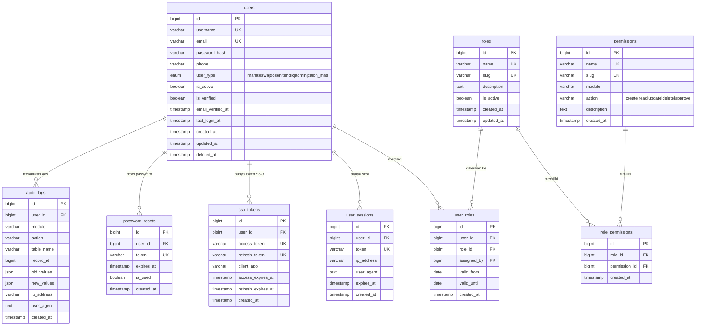
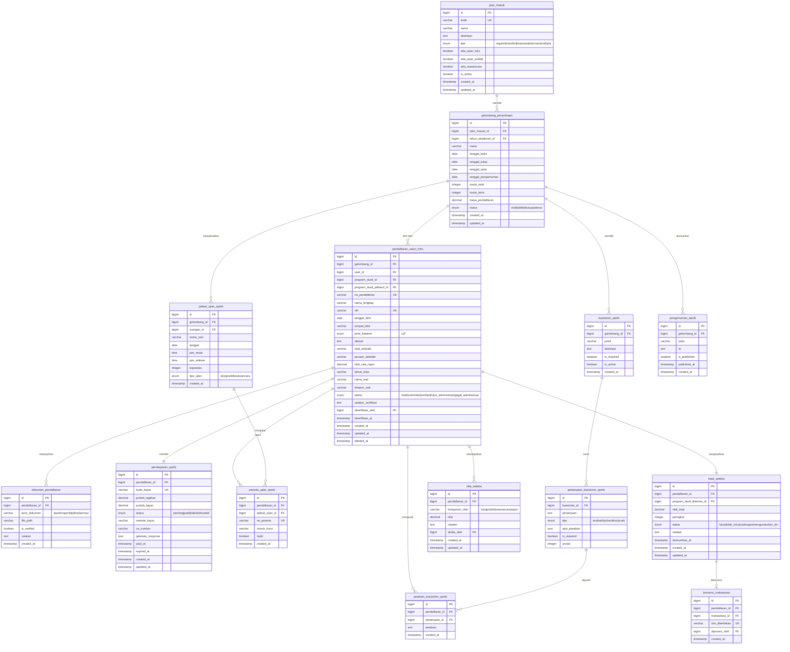
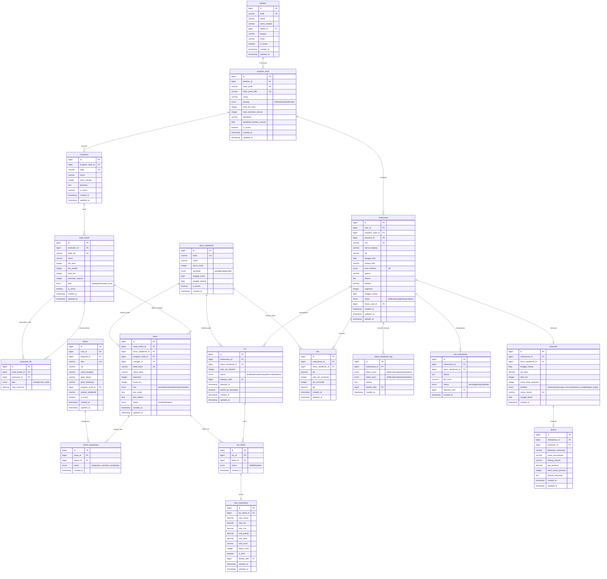

# 🏛️ GLOBAL FINAL ERD — Ekosistem Kampus Terintegrasi
## Part 1 of 4: IAM & Auth Center | SPMB | SIAKAD Core

---

## 📊 Statistik Keseluruhan (Preview)
| Domain | Estimasi Tabel |
|---|---|
| IAM & Auth Center | 9 tabel |
| SPMB | 14 tabel |
| SIAKAD Core | 19 tabel |
| OBE + SIMPI + SIMANTA + SIMPRESKUL | 32 tabel |
| SIKEU | 13 tabel |
| SIMPEG | 12 tabel |
| LMS | 12 tabel |
| SINAPRA | 9 tabel |
| KERJASAMA | 6 tabel |
| UPM | 11 tabel |
| **TOTAL** | **~137 tabel** |

---

## 🔐 MODUL 1: IAM & Auth Center

### Deskripsi Arsitektur
Modul ini adalah fondasi seluruh ekosistem. Semua user dari semua modul (Mahasiswa, Dosen, Tendik, Admin, Calon Mahasiswa) dikelola di sini. RBAC (Role-Based Access Control) granular memungkinkan setiap role memiliki set permission yang berbeda. SSO token memfasilitasi login satu pintu antar-aplikasi.

---

## 📝 MODUL 2: SPMB (Sistem Penerimaan Mahasiswa Baru)

### Deskripsi Arsitektur
Alur bisnis SPMB: Jalur Masuk → Gelombang → Pendaftaran → Pembayaran Biaya Tes → Ujian → Hasil Seleksi → Pengumuman → Konversi ke Mahasiswa (NIM). Setiap tahap memiliki status yang terkunci secara bisnis.

---

## 🎓 MODUL 3: SIAKAD Core

### Deskripsi Arsitektur
Inti sistem akademik. Hierarki: Fakultas → Prodi → Kurikulum → Matakuliah. Mahasiswa terikat ke Prodi & Angkatan. KRS dikunci oleh status bayar SIKEU. Nilai dari LMS di-sync ke sini.

---

## 🏗️ Arsitektur & Strategi (Part 1)

### Indexing Strategy
| Tabel | Index Kritis |
|---|---|
| `users` | `email`, `username` — UNIQUE |
| `audit_logs` | Composite: `(module, action, created_at)` |
| `pendaftaran_calon_mhs` | `no_pendaftaran` UNIQUE, `nik` UNIQUE |
| `mahasiswa` | `nim` UNIQUE, `angkatan` |
| `krs_detail` | Composite UNIQUE: `(krs_id, kelas_id)` |
| `nilai_mahasiswa` | `krs_detail_id` — cover index |
| `kelas` | Composite UNIQUE: `(mata_kuliah_id, tahun_akademik_id, kode_kelas)` |

### Composite Keys & Business Guards
- **KRS Lock**: `krs.locked_by_keuangan = true` → mahasiswa tidak bisa ubah KRS sampai tagihan lunas
- **NIM Unique**: `mahasiswa.nim` — UNIQUE NOT NULL, digenerate saat `konversi_mahasiswa`
- **KRS Duplicate Guard**: UNIQUE constraint `(krs_id, kelas_id)` di `krs_detail` mencegah mahasiswa ambil kelas sama dua kali
- **Prasyarat**: Tabel `prasyarat_mk` bisa rekursif (FK ke mata_kuliah sendiri), harus dicek via stored procedure/application layer

> **Lanjut ke Part 2**: OBE | SIMPI | SIMANTA | SIMPRESKUL | SIKEU
