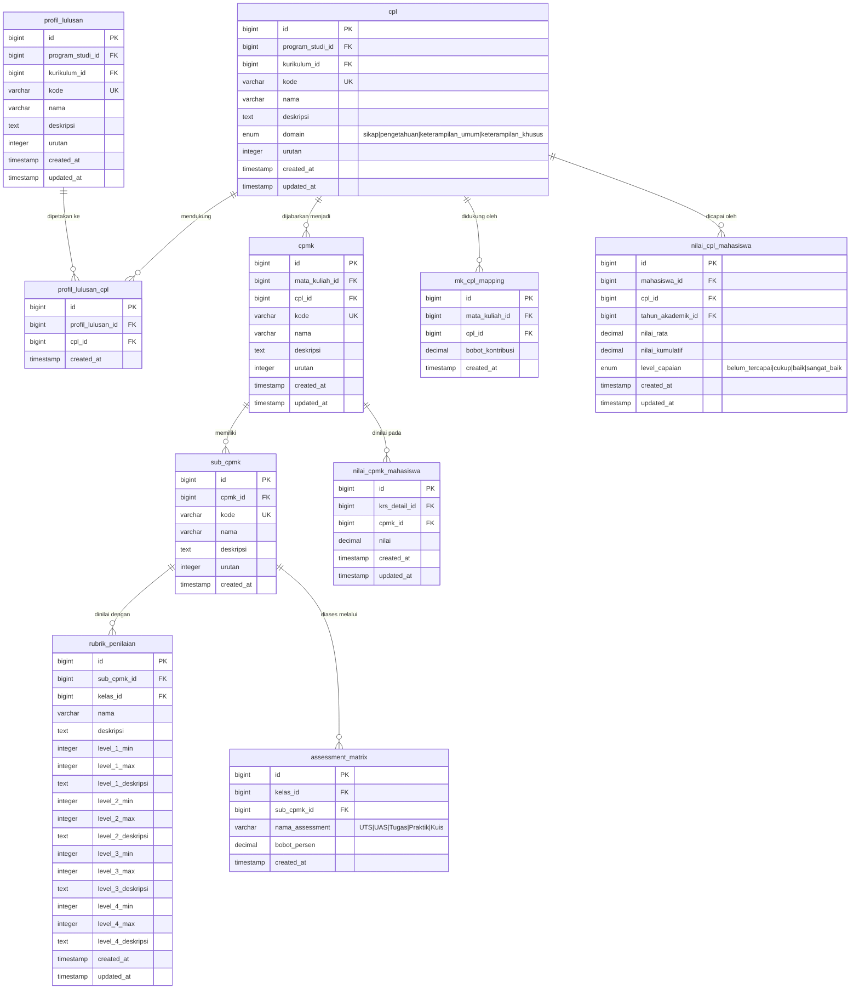
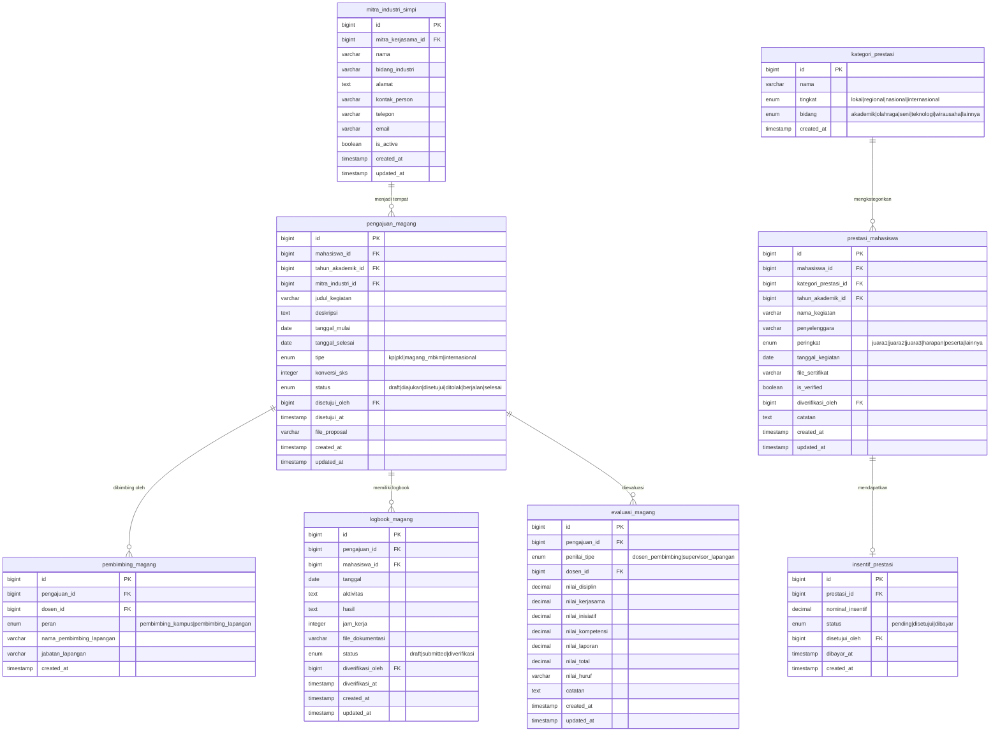
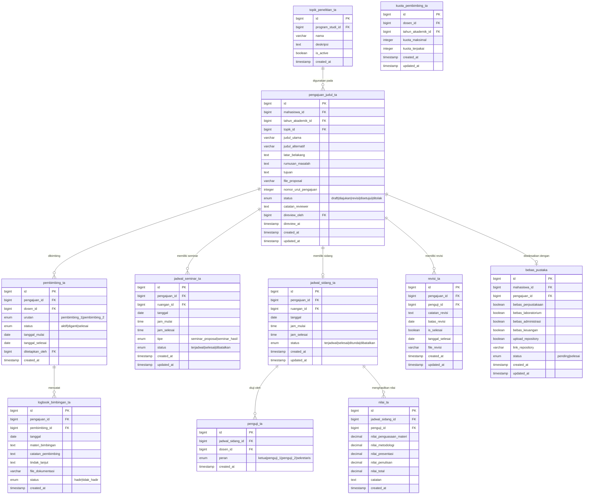
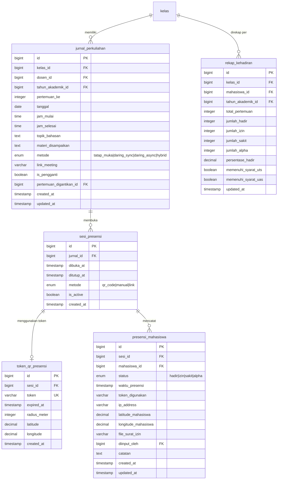
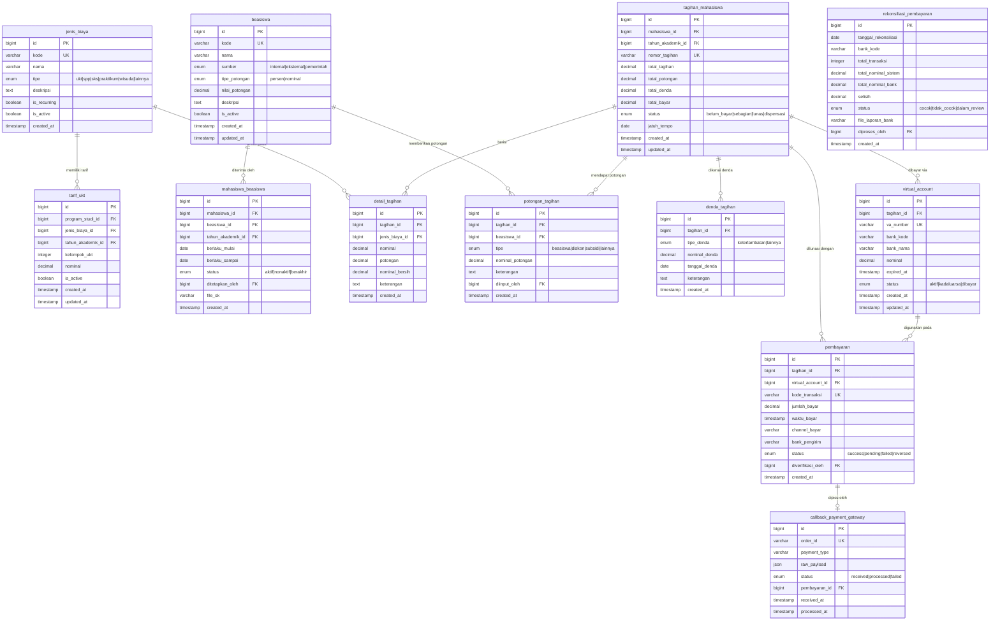

# 🏛️ GLOBAL FINAL ERD — Ekosistem Kampus Terintegrasi
## Part 2 of 4: OBE | SIMPI | SIMANTA | SIMPRESKUL | SIKEU

---

## 📐 MODUL 4A: OBE (Outcome-Based Education)

### Deskripsi Arsitektur
Hierarki OBE: Profil Lulusan → CPL (Capaian Pembelajaran Lulusan) → CPMK → Sub-CPMK. Setiap Matakuliah dipetakan ke CPL tertentu. Assessment matrix menghubungkan Sub-CPMK dengan bobot penilaian. Nilai CPL mahasiswa dihitung agregat dari nilai mata kuliah yang mendukung CPL tersebut.

---

## 🏭 MODUL 4B: SIMPI (Prestasi & Praktik Industri/Magang)

---

## 📜 MODUL 4C: SIMANTA (Tugas Akhir / Skripsi)

---

## 📋 MODUL 4D: SIMPRESKUL (Presensi Kuliah)

---

## 💰 MODUL 5: SIKEU (Sistem Informasi Keuangan)

### Deskripsi Arsitektur
Alur: Tarif UKT/SPP → Generate Tagihan → Potong Beasiswa/Diskon → Bayar via VA → Callback Gateway → Rekonsiliasi → Update Status Bayar → Unlock KRS. Tagihan terkunci ke semester, mahasiswa, dan jenis biaya.

---

## 🏗️ Arsitektur & Strategi (Part 2)

### Business Guards SIKEU
| Guard | Implementasi |
|---|---|
| **KRS Lock** | `tagihan.status != 'lunas'` → set `krs.locked_by_keuangan = true` via trigger/event |
| **VA Unique** | `virtual_account.va_number` — UNIQUE NOT NULL per bank |
| **Double Payment** | `callback_payment_gateway.order_id` — UNIQUE, idempotent callback handling |
| **Tarif History** | Setiap update tarif UKT → insert baru, bukan update (append-only) |

### Indexing OBE & SIMANTA
| Tabel | Index |
|---|---|
| `nilai_cpl_mahasiswa` | Composite: `(mahasiswa_id, cpl_id, tahun_akademik_id)` UNIQUE |
| `rekap_kehadiran` | Composite: `(kelas_id, mahasiswa_id)` UNIQUE |
| `pengajuan_judul_ta` | `(mahasiswa_id, tahun_akademik_id)` — prevent double submission |
| `tagihan_mahasiswa` | `(mahasiswa_id, tahun_akademik_id)` UNIQUE per semester |

> **Lanjut ke Part 3**: SIMPEG | LMS | SINAPRA | KERJASAMA | UPM
