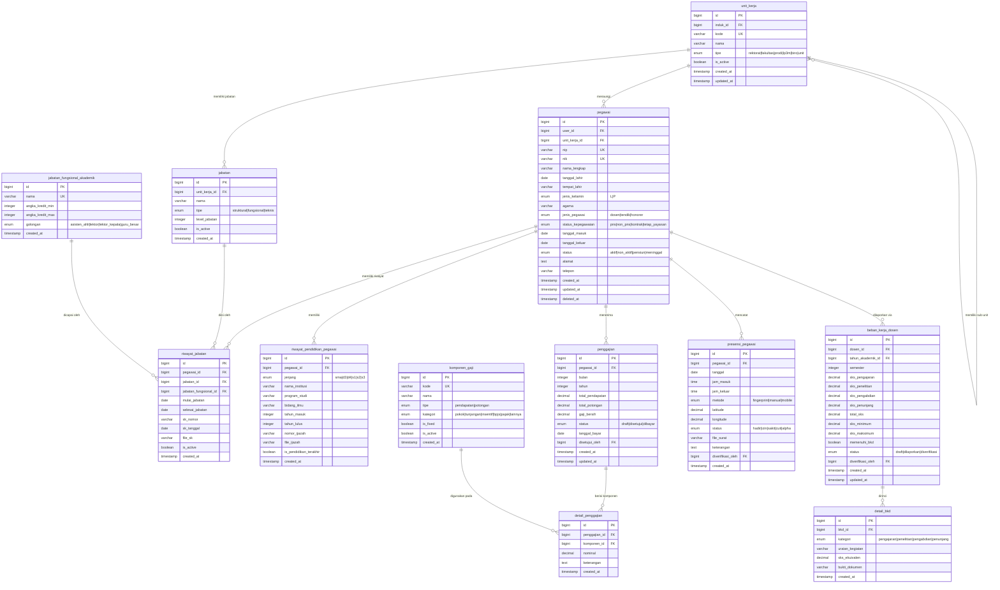
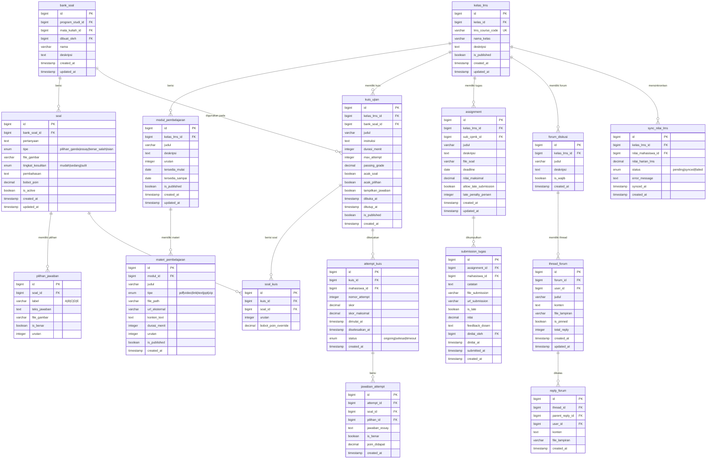
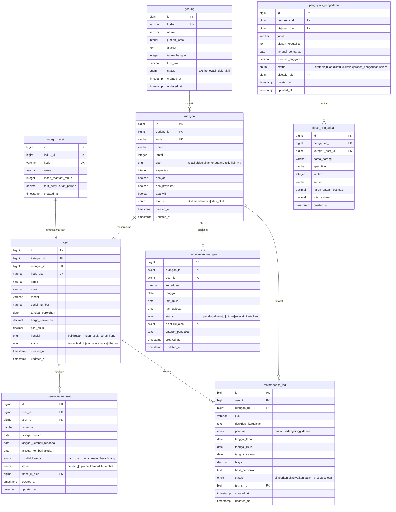
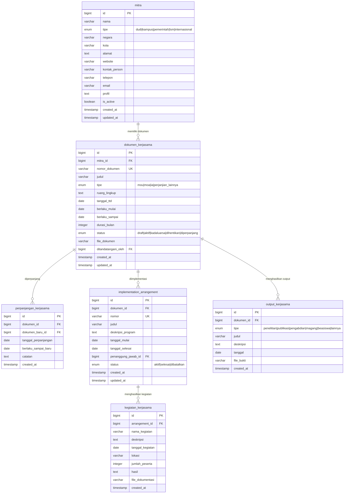

# 🏛️ GLOBAL FINAL ERD — Ekosistem Kampus Terintegrasi
## Part 3 of 4: SIMPEG | LMS | SINAPRA | KERJASAMA | UPM

---

## 👔 MODUL 6: SIMPEG (Sistem Informasi Kepegawaian)

### Deskripsi Arsitektur
`pegawai` adalah entitas induk untuk semua SDM kampus. Dosen memiliki entri di tabel `dosen` (SIAKAD) yang ber-FK ke `pegawai`. NIDN/NIDK dari NIDN disimpan di `dosen`. Penggajian menggunakan komponen dinamis agar fleksibel. BKD (Beban Kerja Dosen) memenuhi standar pelaporan ke PDDikti.

---

## 📚 MODUL 7: LMS (Learning Management System)

### Deskripsi Arsitektur
LMS terintegrasi dengan SIAKAD. `kelas_lms` disinkronisasi dari `kelas` SIAKAD. Nilai harian dari LMS di-sync ke `nilai_mahasiswa` SIAKAD. Bank soal bisa dipakai lintas kelas. Forum diskusi mendukung threading.

---

## 🏢 MODUL 8: SINAPRA (Sarana & Prasarana)

---

## 🤝 MODUL 9: KERJASAMA (Kemitraan)

---

## ✅ MODUL 10: UPM (Unit Penjaminan Mutu & SPMI)

```mermaid
erDiagram
    kategori_dokumen_mutu {
        bigint id PK
        varchar kode UK
        varchar nama
        text deskripsi
        timestamp created_at
    }

    dokumen_mutu {
        bigint id PK
        bigint kategori_id FK
        bigint unit_kerja_id FK
        varchar kode_dokumen UK
        varchar judul
        integer versi
        text deskripsi
        varchar file_path
        enum status "draft|review|berlaku|kadaluarsa|dicabut"
        bigint disahkan_oleh FK
        date tanggal_berlaku
        date tanggal_kadaluarsa
        timestamp created_at
        timestamp updated_at
    }

    revisi_dokumen_mutu {
        bigint id PK
        bigint dokumen_id FK
        integer versi_lama
        integer versi_baru
        text ringkasan_perubahan
        varchar file_lama
        bigint direvisi_oleh FK
        timestamp created_at
    }

    kuesioner_edom {
        bigint id PK
        bigint tahun_akademik_id FK
        varchar judul
        text deskripsi
        date periode_mulai
        date periode_selesai
        boolean is_active
        timestamp created_at
    }

    pertanyaan_edom {
        bigint id PK
        bigint kuesioner_id FK
        text pertanyaan
        enum tipe "skala|pilihan|text"
        json opsi
        integer bobot
        integer urutan
        timestamp created_at
    }

    jawaban_edom {
        bigint id PK
        bigint kuesioner_id FK
        bigint pertanyaan_id FK
        bigint kelas_id FK
        bigint mahasiswa_id FK
        text jawaban
        integer nilai_skala
        timestamp created_at
    }

    rekap_edom {
        bigint id PK
        bigint kuesioner_id FK
        bigint kelas_id FK
        bigint dosen_id FK
        decimal rata_rata_nilai
        integer total_responden
        integer total_mahasiswa
        decimal persentase_respon
        enum kategori "sangat_baik|baik|cukup|kurang"
        timestamp created_at
        timestamp updated_at
    }

    audit_mutu_internal {
        bigint id PK
        bigint unit_kerja_id FK
        bigint tahun_akademik_id FK
        varchar nomor_ami
        varchar judul
        date tanggal_audit
        bigint ketua_auditor_id FK
        enum status "perencanaan|pelaksanaan|pelaporan|tindak_lanjut|selesai"
        varchar file_instrumen
        varchar file_laporan
        timestamp created_at
        timestamp updated_at
    }

    tim_auditor_ami {
        bigint id PK
        bigint ami_id FK
        bigint pegawai_id FK
        enum peran "ketua|anggota|pengamat"
        timestamp created_at
    }

    temuan_ami {
        bigint id PK
        bigint ami_id FK
        enum tipe "kts_mayor|kts_minor|observasi|peluang_perbaikan"
        text uraian_temuan
        text standar_acuan
        text bukti_temuan
        bigint ditemukan_oleh FK
        timestamp created_at
    }

    tindak_lanjut_ami {
        bigint id PK
        bigint temuan_id FK
        text rencana_tindak_lanjut
        date target_selesai
        bigint penanggung_jawab_id FK
        text realisasi
        date tanggal_realisasi
        varchar file_bukti
        enum status "open|in_progress|closed|verifikasi"
        bigint diverifikasi_oleh FK
        timestamp created_at
        timestamp updated_at
    }

    indikator_kinerja_utama {
        bigint id PK
        varchar kode UK
        varchar nama
        text deskripsi
        enum perspektif "iku1|iku2|iku3|iku4|iku5|iku6|iku7|iku8"
        varchar satuan
        decimal target_nasional
        boolean is_active
        timestamp created_at
    }

    nilai_iku {
        bigint id PK
        bigint iku_id FK
        bigint program_studi_id FK
        bigint tahun_akademik_id FK
        decimal nilai_target
        decimal nilai_capaian
        decimal persentase_capaian
        text keterangan
        varchar file_bukti
        bigint diinput_oleh FK
        timestamp created_at
        timestamp updated_at
    }

    dokumen_akreditasi {
        bigint id PK
        bigint program_studi_id FK
        enum lembaga "ban_pt|lamdik|lam_lainnya"
        varchar nama_instrumen
        varchar kode_instrumen
        date tanggal_pengajuan
        date tanggal_visitasi
        date tanggal_keputusan
        varchar nomor_sk
        varchar peringkat_lama
        varchar peringkat_baru
        date berlaku_sampai
        varchar file_led
        varchar file_lkps
        varchar file_sk_akreditasi
        enum status "persiapan|diajukan|visitasi|keputusan|selesai"
        timestamp created_at
        timestamp updated_at
    }

    kategori_dokumen_mutu ||--o{ dokumen_mutu : "mengkategorikan"
    dokumen_mutu ||--o{ revisi_dokumen_mutu : "direvisi"
    kuesioner_edom ||--o{ pertanyaan_edom : "berisi"
    kuesioner_edom ||--o{ jawaban_edom : "menerima jawaban"
    pertanyaan_edom ||--o{ jawaban_edom : "dijawab"
    kuesioner_edom ||--o{ rekap_edom : "direkap"
    audit_mutu_internal ||--o{ tim_auditor_ami : "melibatkan"
    audit_mutu_internal ||--o{ temuan_ami : "menghasilkan"
    temuan_ami ||--o{ tindak_lanjut_ami : "ditindaklanjuti"
    indikator_kinerja_utama ||--o{ nilai_iku : "dicapai oleh"
    program_studi ||--o{ nilai_iku : "memiliki"
    program_studi ||--o{ dokumen_akreditasi : "memiliki"
```

---

## 🏗️ Arsitektur & Strategi (Part 3)

### BKD Integration Guard
| Field | Constraint |
|---|---|
| `beban_kerja_dosen.(dosen_id, tahun_akademik_id, semester)` | **UNIQUE** — satu laporan per dosen per semester |
| `sks_pengajaran` | Dihitung otomatis dari `dosen_pengampu` join `kelas.total_sks` |
| `memenuhi_bkd` | Computed: `total_sks BETWEEN sks_minimum AND sks_maksimum` |

### LMS ↔ SIAKAD Sync Guard
- `sync_nilai_lms.status = 'pending'` → job queue memproses dan update `nilai_mahasiswa.nilai_harian`
- Idempotent sync: jika sudah `synced`, tidak di-overwrite kecuali ada flag `force_sync`

### EDOM Anonymity Guard
- `jawaban_edom` menyimpan `mahasiswa_id` untuk mencegah double submission
- Rekap hanya diakses via `rekap_edom` (aggregated view) — detail jawaban hanya bisa diakses Penjaminan Mutu

> **Lanjut ke Part 4**: Master ERD Overview + Integration Map + Full Architecture Notes
