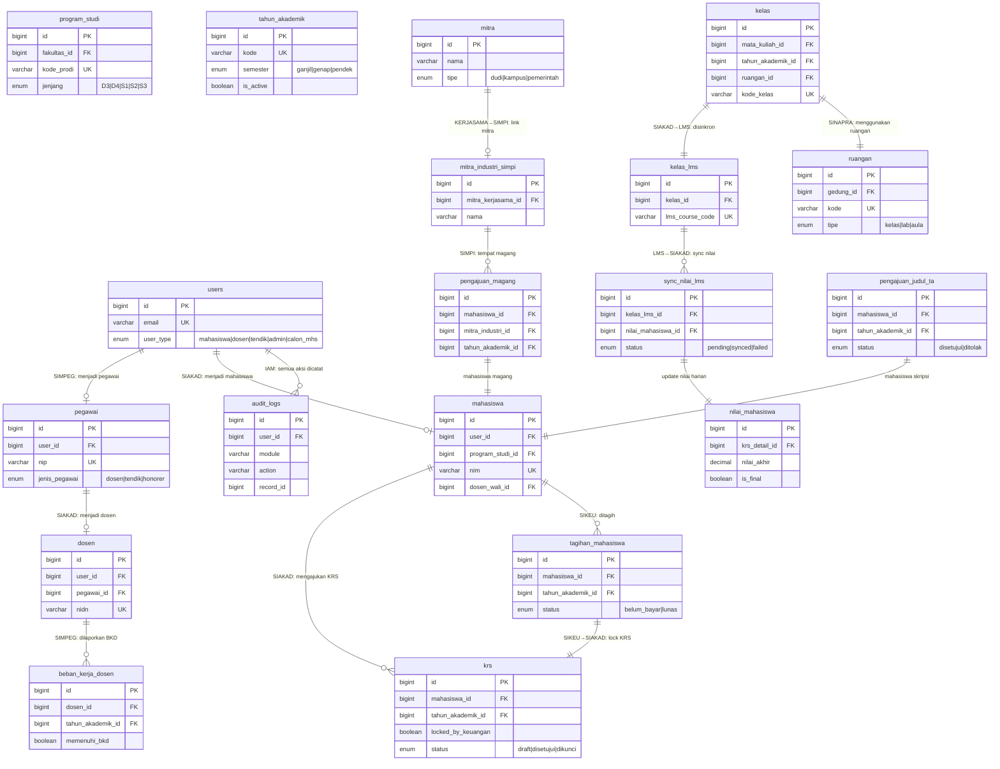

# 🏛️ GLOBAL FINAL ERD — Ekosistem Kampus Terintegrasi
## Part 4 of 4: Master Integration Map | Full Architecture Notes

---

## 🗺️ Cross-Module Integration Diagram

Diagram ini menunjukkan bagaimana entitas-entitas lintas modul saling terhubung di level database.



---

## 📊 Statistik Final ERD

| No | Domain Modul | Jumlah Tabel |
|---|---|---|
| 1 | IAM & Auth Center | 9 |
| 2 | SPMB | 14 |
| 3 | SIAKAD Core | 19 |
| 4a | OBE | 10 |
| 4b | SIMPI | 8 |
| 4c | SIMANTA | 11 |
| 4d | SIMPRESKUL | 5 |
| 5 | SIKEU | 13 |
| 6 | SIMPEG | 11 |
| 7 | LMS | 14 |
| 8 | SINAPRA | 9 |
| 9 | KERJASAMA | 6 |
| 10 | UPM | 11 |
| **TOTAL** | **13 Domain** | **🔴 140 Tabel** |

---

## 🏗️ Arsitektur Final — Strategi Lengkap

### 1. Normalisasi: 3NF / BCNF

Seluruh tabel dirancang minimal 3NF:
- **Tidak ada Partial Dependency**: Setiap atribut non-key bergantung penuh pada PK
- **Tidak ada Transitive Dependency**: Nilai IPK tidak disimpan redundan di `mahasiswa`, melainkan dihitung dari `khs` terbaru
- **Pengecualian terkontrol (Denormalisasi Terencana)**:
  - `khs.ipk` — disimpan karena intensitas query tinggi (dashboard, laporan PDDikti)
  - `rekap_kehadiran` — materialized summary dari `presensi_mahasiswa` untuk performa
  - `rekap_edom` — aggregated dari `jawaban_edom` untuk proteksi anonimitas

---

### 2. Indexing Strategy Per Domain

#### IAM
```sql
-- Pencarian cepat login
CREATE UNIQUE INDEX idx_users_email ON users(email);
CREATE UNIQUE INDEX idx_users_username ON users(username);
-- Audit trail query
CREATE INDEX idx_audit_module_action ON audit_logs(module, action, created_at);
-- Session cleanup job
CREATE INDEX idx_sessions_expires ON user_sessions(expires_at);
```

#### SPMB
```sql
CREATE UNIQUE INDEX idx_pendaftaran_no ON pendaftaran_calon_mhs(no_pendaftaran);
CREATE INDEX idx_pendaftaran_gelombang ON pendaftaran_calon_mhs(gelombang_id, status);
CREATE UNIQUE INDEX idx_hasil_seleksi_pendaftaran ON hasil_seleksi(pendaftaran_id);
```

#### SIAKAD Core
```sql
CREATE UNIQUE INDEX idx_mahasiswa_nim ON mahasiswa(nim);
CREATE INDEX idx_mahasiswa_prodi_angkatan ON mahasiswa(program_studi_id, angkatan, status);
-- KRS Duplicate Guard
CREATE UNIQUE INDEX idx_krs_detail_unique ON krs_detail(krs_id, kelas_id);
-- Nilai query by semester
CREATE INDEX idx_nilai_krs_detail ON nilai_mahasiswa(krs_detail_id);
-- Kelas lookup
CREATE UNIQUE INDEX idx_kelas_mk_ta ON kelas(mata_kuliah_id, tahun_akademik_id, kode_kelas);
```

#### OBE
```sql
CREATE UNIQUE INDEX idx_nilai_cpl_unique ON nilai_cpl_mahasiswa(mahasiswa_id, cpl_id, tahun_akademik_id);
CREATE UNIQUE INDEX idx_mk_cpl_unique ON mk_cpl_mapping(mata_kuliah_id, cpl_id);
```

#### SIKEU
```sql
-- Tagihan unique per mahasiswa per semester
CREATE UNIQUE INDEX idx_tagihan_mhs_ta ON tagihan_mahasiswa(mahasiswa_id, tahun_akademik_id);
CREATE UNIQUE INDEX idx_va_number ON virtual_account(va_number);
-- Idempotent callback
CREATE UNIQUE INDEX idx_callback_order ON callback_payment_gateway(order_id);
-- Pembayaran lookup
CREATE INDEX idx_pembayaran_tagihan ON pembayaran(tagihan_id, status);
```

#### SIMPEG
```sql
CREATE UNIQUE INDEX idx_pegawai_nip ON pegawai(nip);
-- BKD unique per dosen per semester
CREATE UNIQUE INDEX idx_bkd_unique ON beban_kerja_dosen(dosen_id, tahun_akademik_id, semester);
-- Presensi lookup harian
CREATE INDEX idx_presensi_pegawai_tgl ON presensi_pegawai(pegawai_id, tanggal);
```

#### SIMPRESKUL
```sql
-- Presensi duplicate guard
CREATE UNIQUE INDEX idx_presensi_mhs_sesi ON presensi_mahasiswa(sesi_id, mahasiswa_id);
-- Rekap unique
CREATE UNIQUE INDEX idx_rekap_kelas_mhs ON rekap_kehadiran(kelas_id, mahasiswa_id);
-- Token QR expiry check
CREATE INDEX idx_token_expired ON token_qr_presensi(expired_at);
```

#### LMS
```sql
-- Satu kelas SIAKAD = satu kelas LMS
CREATE UNIQUE INDEX idx_kelas_lms_siakad ON kelas_lms(kelas_id);
-- Attempt limit check
CREATE INDEX idx_attempt_kuis_mhs ON attempt_kuis(kuis_id, mahasiswa_id);
-- Submission lookup
CREATE UNIQUE INDEX idx_submission_mhs ON submission_tugas(assignment_id, mahasiswa_id);
```

---

### 3. Composite Keys & Business Guards

| Guard | Tabel | Implementasi |
|---|---|---|
| **KRS Lock oleh SIKEU** | `krs.locked_by_keuangan` | Set `true` via DB trigger saat tagihan belum lunas pada awal semester |
| **Syarat KRS** | `prasyarat_mk` | Dicek di application layer sebelum insert `krs_detail` |
| **Kapasitas Kelas** | `kelas.kuota_krs` | CHECK via trigger: `kuota_terisi <= kapasitas` |
| **Satu NIM per Mahasiswa** | `mahasiswa.nim` | UNIQUE NOT NULL, generated saat konversi SPMB |
| **Satu NIDN per Dosen** | `dosen.nidn` | UNIQUE NOT NULL, sesuai standar PDDikti |
| **Idempotent VA Callback** | `callback_payment_gateway.order_id` | UNIQUE — prevent duplicate processing |
| **Satu Tagihan per Semester** | `tagihan_mahasiswa.(mahasiswa_id, tahun_akademik_id)` | UNIQUE COMPOSITE |
| **Satu Sidang TA** | `jadwal_sidang_ta.(pengajuan_id)` | ONE-TO-ONE |
| **BKD per Semester** | `beban_kerja_dosen.(dosen_id, tahun_akademik_id, semester)` | UNIQUE COMPOSITE |
| **Rekap Kehadiran** | `rekap_kehadiran.(kelas_id, mahasiswa_id)` | UNIQUE COMPOSITE |
| **CPL Achievement** | `nilai_cpl_mahasiswa.(mahasiswa_id, cpl_id, tahun_akademik_id)` | UNIQUE COMPOSITE |
| **EDOM Double Submission** | `jawaban_edom.(kuesioner_id, pertanyaan_id, mahasiswa_id)` | UNIQUE COMPOSITE |

---

### 4. Soft Delete Strategy

Semua tabel master dan transaksional penting menggunakan **Soft Delete** via kolom `deleted_at`:

```sql
-- Query default ALWAYS filter soft-deleted
SELECT * FROM mahasiswa WHERE deleted_at IS NULL;

-- Tabel yang WAJIB soft delete:
-- users, mahasiswa, dosen, pegawai, mata_kuliah, 
-- pendaftaran_calon_mhs, krs, tagihan_mahasiswa,
-- dokumen_kerjasama, aset, dokumen_mutu
```

**Tabel yang TIDAK perlu soft delete** (log/audit/immutable):
- `audit_logs`, `pembayaran`, `callback_payment_gateway`, `presensi_mahasiswa`, `logbook_magang`, `logbook_bimbingan_ta`

---

### 5. Data Integrity Guards (Trigger & Constraint Level)

```sql
-- Guard 1: KRS hanya bisa diajukan jika tagihan lunas
CREATE OR REPLACE FUNCTION check_krs_lock() RETURNS TRIGGER AS $$
BEGIN
  IF (SELECT locked_by_keuangan FROM krs WHERE id = NEW.krs_id) = TRUE THEN
    RAISE EXCEPTION 'KRS dikunci oleh keuangan. Lunasi tagihan terlebih dahulu.';
  END IF;
  RETURN NEW;
END;
$$ LANGUAGE plpgsql;
CREATE TRIGGER trg_krs_detail_lock BEFORE INSERT ON krs_detail
  FOR EACH ROW EXECUTE FUNCTION check_krs_lock();

-- Guard 2: Update locked_by_keuangan saat tagihan lunas
CREATE OR REPLACE FUNCTION sync_krs_lock() RETURNS TRIGGER AS $$
BEGIN
  IF NEW.status = 'lunas' THEN
    UPDATE krs SET locked_by_keuangan = FALSE
    WHERE mahasiswa_id = NEW.mahasiswa_id 
      AND tahun_akademik_id = NEW.tahun_akademik_id;
  END IF;
  RETURN NEW;
END;
$$ LANGUAGE plpgsql;
CREATE TRIGGER trg_tagihan_unlock_krs AFTER UPDATE ON tagihan_mahasiswa
  FOR EACH ROW EXECUTE FUNCTION sync_krs_lock();

-- Guard 3: Rekap kehadiran auto-update
CREATE OR REPLACE FUNCTION update_rekap_kehadiran() RETURNS TRIGGER AS $$
BEGIN
  -- recalculate rekap_kehadiran for this mahasiswa in this kelas
  UPDATE rekap_kehadiran SET
    jumlah_hadir = (SELECT COUNT(*) FROM presensi_mahasiswa pm 
                    JOIN sesi_presensi sp ON pm.sesi_id = sp.id
                    JOIN jurnal_perkuliahan jp ON sp.jurnal_id = jp.id
                    WHERE pm.mahasiswa_id = NEW.mahasiswa_id 
                      AND jp.kelas_id = (
                        SELECT jp2.kelas_id FROM jurnal_perkuliahan jp2 
                        JOIN sesi_presensi sp2 ON sp2.jurnal_id = jp2.id
                        WHERE sp2.id = NEW.sesi_id LIMIT 1)
                      AND pm.status = 'hadir'),
    updated_at = NOW()
  WHERE mahasiswa_id = NEW.mahasiswa_id;
  RETURN NEW;
END;
$$ LANGUAGE plpgsql;
```

---

### 6. Naming Convention

| Elemen | Konvensi | Contoh |
|---|---|---|
| Tabel | `snake_case`, noun plural | `mahasiswa`, `krs_detail` |
| PK | `id bigint` AUTO_INCREMENT/SERIAL | `id BIGSERIAL PRIMARY KEY` |
| FK | `{tabel_referensi_singular}_id` | `mahasiswa_id`, `kelas_id` |
| Junction Table | `{tabel_a}_{tabel_b}` | `mk_cpl_mapping`, `user_roles` |
| Enum Status | Lowercase dengan underscore | `'belum_bayar'`, `'cum_laude'` |
| Audit Columns | Standar 4 kolom | `created_at`, `updated_at`, `deleted_at`, `created_by` |
| Index | `idx_{tabel}_{kolom(s)}` | `idx_mahasiswa_nim` |
| Trigger | `trg_{aksi}_{tabel}` | `trg_krs_detail_lock` |

---

### 7. PDDikti Compliance Fields

Tabel dan field yang kritis untuk pelaporan PDDikti:

| Entitas PDDikti | Field Wajib | Tabel Sumber |
|---|---|---|
| Data Mahasiswa | NIM, NIDN Dosen Wali, angkatan, status | `mahasiswa` |
| Data Dosen | NIDN, NIDK, jabatan_akademik | `dosen` |
| Kurikulum | kode_prodi_dikti, total_sks_lulus | `program_studi`, `kurikulum` |
| Perkuliahan | kode_kelas, total_sks, jam_tatap_muka | `kelas`, `jurnal_perkuliahan` |
| Nilai | nilai_huruf, bobot_mutu, is_final | `nilai_mahasiswa` |
| Kelulusan | nomor_ijazah, ipk_akhir, masa_studi | `kelulusan` |
| BKD Dosen | sks_pengajaran, total_sks, memenuhi_bkd | `beban_kerja_dosen` |
| Akreditasi | lembaga, peringkat, berlaku_sampai | `dokumen_akreditasi` |

---

### 8. High Availability & Deployment Recommendation

```
┌─────────────────────────────────────────────────────────┐
│                   PRODUCTION SETUP                       │
│                                                         │
│  ┌─────────┐    ┌─────────────────────────────────────┐ │
│  │  App    │───▶│  PostgreSQL 16 Primary (Write)       │ │
│  │  Layer  │    │  + Read Replicas x2 (SIAKAD/LMS)    │ │
│  └─────────┘    └─────────────────────────────────────┘ │
│                           │                             │
│                    ┌──────┴──────┐                      │
│                    │  Redis      │  Session, Queue,     │
│                    │  Cluster    │  Cache (KRS Lock,    │
│                    └─────────────┘  Rekap Cache)        │
│                                                         │
│  ┌──────────────────────────────────────────────────┐   │
│  │  Partitioning Strategy:                          │   │
│  │  • audit_logs    → PARTITION BY RANGE(created_at)│   │
│  │  • presensi_mhs  → PARTITION BY RANGE(created_at)│   │
│  │  • jawaban_edom  → PARTITION BY LIST(kuesioner_id)│  │
│  │  • pembayaran    → PARTITION BY RANGE(created_at)│   │
│  └──────────────────────────────────────────────────┘   │
│                                                         │
│  Schema Separation (Multi-Schema PostgreSQL):           │
│  • schema: iam        (users, roles, permissions)       │
│  • schema: akademik   (SIAKAD, OBE, SIMPI, SIMANTA)    │
│  • schema: keuangan   (SIKEU)                           │
│  • schema: kepegawaian (SIMPEG)                         │
│  • schema: lms        (LMS)                             │
│  • schema: sarana     (SINAPRA)                         │
│  • schema: mutu       (UPM, KERJASAMA)                  │
└─────────────────────────────────────────────────────────┘
```

---

### 9. Event & Queue Architecture untuk Integrasi Antar-Modul

| Event | Producer | Consumer | Deskripsi |
|---|---|---|---|
| `mahasiswa.registered` | SPMB | IAM, SIAKAD | Auto-create user + nim setelah konversi |
| `tagihan.lunas` | SIKEU | SIAKAD | Unlock KRS mahasiswa |
| `tagihan.generated` | SIKEU | Notifikasi | Push notif tagihan baru |
| `nilai.synced` | LMS | SIAKAD | Update nilai_harian di SIAKAD |
| `krs.dikunci` | SIAKAD | SIKEU | Generate tagihan semester |
| `presensi.updated` | SIMPRESKUL | SIAKAD | Update rekap kehadiran |
| `bkd.dilaporkan` | SIMPEG | UPM | Feed data IKU dosen |
| `va.callback` | Payment GW | SIKEU | Process pembayaran |

---

## 📁 Daftar File ERD

| File | Cakupan Modul |
|---|---|
| [Part 1 — IAM, SPMB, SIAKAD Core](./ERD_Ekosistem_Kampus_Part1_IAM_SPMB_SIAKAD.md) | 42 tabel |
| [Part 2 — OBE, SIMPI, SIMANTA, SIMPRESKUL, SIKEU](./ERD_Ekosistem_Kampus_Part2_OBE_SIMPI_SIMANTA_SIKEU.md) | 47 tabel |
| [Part 3 — SIMPEG, LMS, SINAPRA, KERJASAMA, UPM](./ERD_Ekosistem_Kampus_Part3_SIMPEG_LMS_SINAPRA_UPM.md) | 51 tabel |
| **Part 4 — Master Integration + Architecture Notes** | **Cross-module** |

> **Total: 140 Tabel | 13 Domain Modul | Production-Ready Architecture**
