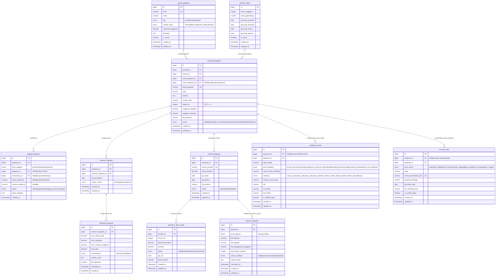

# 🏛️ GLOBAL FINAL ERD — Ekosistem Kampus Terintegrasi
## Part 5 of 5: SIPPM (Sistem Informasi Penelitian & Pengabdian Masyarakat)

---

## 🔬 MODUL 11: SIPPM (Sistem Informasi Penelitian & Pengabdian Masyarakat)

### Deskripsi Arsitektur Modul
Modul **SIPPM** mengelola seluruh siklus hidup (*lifecycle*) tridharma perguruan tinggi di bidang **Penelitian**, **Pengabdian kepada Masyarakat (PkM)**, dan **Publikasi/Portofolio Luaran Ilmiah Dosen**.

Modul ini terhubung langsung dengan:
1. **IAM (Central Auth)**: Pengaturan hak akses Dosen Pengusul, Reviewer, dan Operator LPPM via RBAC.
2. **SIMPEG**: Menarik identitas `pegawai_id` Dosen, serta meng-export data luaran yang sudah disetujui (*approved*) ke tabel `detail_bkd` (SKS Beban Kerja Dosen) dan `usulan_jafung` (KUM Kenaikan Pangkat/Jafung).
3. **SIAKAD**: Menarik identitas `mahasiswa_id` yang dilibatkan dalam tim kegiatan untuk keperluan rekognisi MBKM / Tugas Akhir.
4. **SIKEU**: Mengirim rincian `pencairan_dana_hibah` untuk pembayaran bertahap ke rekening Dosen.
5. **KERJASAMA**: Menghubungkan penelitian/PkM terapan dengan `mitra_id` dan `dokumen_kerjasama_id` (MoU/MoA).
6. **UPM**: Menyediakan data metrik real-time untuk Indikator Kinerja Utama (IKU 5 & IKU 6) Akreditas Kampus.

---

### 📐 Mermaid ERD Diagram



---

### 📋 Rincian Kamus Data (Data Dictionary)

#### 1. `skema_kegiatan`
| Kolom | Tipe Data | Atribut | Keterangan |
| --- | --- | --- | --- |
| `id` | bigint | PK, Auto Increment | ID Skema Kegiatan |
| `kode` | varchar(50) | Unique, Not Null | Kode unik skema (contoh: `SKM-PEN-01`) |
| `nama` | varchar(255) | Not Null | Nama skema hibah/kegiatan |
| `tipe` | enum | Not Null | `'penelitian'`, `'pengabdian'` |
| `sumber_dana` | enum | Not Null | `'internal'`, `'dikti_bima'`, `'mitra_industri'`, `'mandiri'` |
| `maksimal_anggaran`| decimal(15,2) | Default `0.00` | Plafon batas anggaran maksimal |
| `deskripsi` | text | Nullable | Detail rincian & kualifikasi pengusul |
| `is_active` | boolean | Default `true` | Status aktif/non-aktif skema |
| `created_at` | timestamp | Nullable | Waktu pembuatan |
| `updated_at` | timestamp | Nullable | Waktu pembaruan |

#### 2. `periode_hibah`
| Kolom | Tipe Data | Atribut | Keterangan |
| --- | --- | --- | --- |
| `id` | bigint | PK, Auto Increment | ID Periode Hibah |
| `tahun_anggaran` | integer | Not Null | Tahun anggaran (contoh: `2026`) |
| `nama_gelombang` | varchar(100) | Not Null | Contoh: `Gelombang 1 Hibah Internal` |
| `tgl_buka_proposal`| date | Not Null | Tanggal awal pengusulan |
| `tgl_tutup_proposal`| date | Not Null | Tanggal batas akhir submit |
| `tgl_tutup_monev` | date | Nullable | Tanggal batas akhir laporan kemajuan |
| `tgl_tutup_laporan`| date | Nullable | Tanggal batas akhir laporan akhir |
| `is_active` | boolean | Default `true` | Status gelombang aktif |
| `created_at` | timestamp | Nullable | Waktu pembuatan |
| `updated_at` | timestamp | Nullable | Waktu pembaruan |

#### 3. `proposal_kegiatan`
| Kolom | Tipe Data | Atribut | Keterangan |
| --- | --- | --- | --- |
| `id` | bigint | PK, Auto Increment | ID Proposal |
| `periode_id` | bigint | FK (`periode_hibah.id`), Not Null | Periode gelombang hibah |
| `skema_id` | bigint | FK (`skema_kegiatan.id`), Not Null | Skema kegiatan yang dipilih |
| `ketua_pegawai_id` | bigint | FK (`pegawai.id`), Not Null | ID Pegawai Dosen Pengusul (SIMPEG) |
| `mitra_kerjasama_id`| bigint | FK (`mitra.id`), Nullable | ID Mitra jika menggandeng mitra (KERJASAMA) |
| `kode_proposal` | varchar(100) | Unique, Not Null | Nomor registrasi proposal |
| `judul` | text | Not Null | Judul penelitian / pengabdian |
| `abstrak` | text | Not Null | Abstrak/ringkasan proposal |
| `rumpun_ilmu` | varchar(150) | Not Null | Bidang keahlian/ilmu |
| `target_tkt` | integer | Default `1` | Tingkat Kesiapterapan Teknologi (1 - 9) |
| `anggaran_diajukan`| decimal(15,2) | Not Null | Total biaya yang diusulkan |
| `anggaran_disetujui`| decimal(15,2) | Default `0.00` | Total biaya hasil rekomendasi LPPM |
| `file_proposal` | varchar(255) | Not Null | Path lokasi berkas PDF proposal |
| `status` | enum | Default `'draft'` | `'draft'`, `'diajukan'`, `'plot_reviewer'`, `'penilaian'`, `'revisi'`, `'lolos'`, `'ditolak'`, `'berjalan'`, `'selesai'` |
| `created_at` | timestamp | Nullable | Waktu pembuatan |
| `updated_at` | timestamp | Nullable | Waktu pembaruan |

#### 4. `anggota_kegiatan`
| Kolom | Tipe Data | Atribut | Keterangan |
| --- | --- | --- | --- |
| `id` | bigint | PK, Auto Increment | ID Anggota Tim |
| `proposal_id` | bigint | FK (`proposal_kegiatan.id`), Not Null | Proposal yang diikuti |
| `jenis_anggota` | enum | Not Null | `'dosen'`, `'mahasiswa'`, `'eksternal'` |
| `pegawai_id` | bigint | FK (`pegawai.id`), Nullable | ID Pegawai Dosen Anggota (SIMPEG) |
| `mahasiswa_id` | bigint | FK (`mahasiswa.id`), Nullable | ID Mahasiswa Anggota (SIAKAD) |
| `nama_eksternal` | varchar(255) | Nullable | Nama anggota jika dari mitra/praktisi eksternal |
| `instansi_eksternal`| varchar(255) | Nullable | Nama instansi asal anggota eksternal |
| `peran` | enum | Default `'anggota'` | `'ketua'`, `'anggota'`, `'penanggung_jawab_lapangan'` |
| `tugas_kegiatan` | text | Nullable | Rincian pembagian tugas dalam tim |
| `created_at` | timestamp | Nullable | Waktu pembuatan |

#### 5. `reviewer_kegiatan`
| Kolom | Tipe Data | Atribut | Keterangan |
| --- | --- | --- | --- |
| `id` | bigint | PK, Auto Increment | ID Penugasan Reviewer |
| `proposal_id` | bigint | FK (`proposal_kegiatan.id`), Not Null | Proposal yang dinilai |
| `reviewer_pegawai_id`| bigint | FK (`pegawai.id`), Not Null | ID Pegawai Dosen Reviewer (SIMPEG) |
| `tgl_penugasan` | date | Not Null | Tanggal penugasan oleh LPPM |
| `status_review` | enum | Default `'pending'` | `'pending'`, `'proses'`, `'selesai'` |
| `created_at` | timestamp | Nullable | Waktu penugasan |
| `updated_at` | timestamp | Nullable | Waktu pembaruan |

#### 6. `penilaian_proposal`
| Kolom | Tipe Data | Atribut | Keterangan |
| --- | --- | --- | --- |
| `id` | bigint | PK, Auto Increment | ID Hasil Penilaian |
| `reviewer_kegiatan_id`| bigint | FK (`reviewer_kegiatan.id`), Not Null | Penugasan reviewer terkait |
| `skor_rekam_jejak` | decimal(5,2) | Default `0.00` | Nilai rekam jejak pengusul |
| `skor_substansi` | decimal(5,2) | Default `0.00` | Nilai bobot kelayakan ilmiah |
| `skor_rencana_anggaran`| decimal(5,2) | Default `0.00` | Nilai efisiensi RAB |
| `skor_total` | decimal(5,2) | Default `0.00` | Total skor akumulasi |
| `rekomendasi` | enum | Not Null | `'diterima'`, `'revisi'`, `'ditolak'` |
| `catatan_revisi` | text | Nullable | Catatan koreksi untuk pengusul |
| `file_penilaian` | varchar(255) | Nullable | Berkas rubrik penilaian bertanda tangan |
| `submitted_at` | timestamp | Nullable | Waktu submit penilaian |
| `created_at` | timestamp | Nullable | Waktu pembuatan |

#### 7. `kontrak_kegiatan`
| Kolom | Tipe Data | Atribut | Keterangan |
| --- | --- | --- | --- |
| `id` | bigint | PK, Auto Increment | ID Kontrak Perjanjian |
| `proposal_id` | bigint | FK (`proposal_kegiatan.id`), Not Null | Proposal yang didanai |
| `nomor_kontrak` | varchar(100) | Unique, Not Null | Nomor SK/Kontrak Pelaksanaan LPPM |
| `dana_disetujui` | decimal(15,2) | Not Null | Total dana hibah cair |
| `tgl_mulai` | date | Not Null | Tanggal awal pelaksanaan |
| `tgl_selesai` | date | Not Null | Tanggal target pengumpulan laporan |
| `file_kontrak` | varchar(255) | Not Null | Berkas PDF Surat Perjanjian Kerja (SPK) |
| `status` | enum | Default `'aktif'` | `'aktif'`, `'selesai'`, `'dibatalkan'` |
| `created_at` | timestamp | Nullable | Waktu pembuatan |
| `updated_at` | timestamp | Nullable | Waktu pembaruan |

#### 8. `pencairan_dana_hibah`
| Kolom | Tipe Data | Atribut | Keterangan |
| --- | --- | --- | --- |
| `id` | bigint | PK, Auto Increment | ID Pencairan Dana |
| `kontrak_id` | bigint | FK (`kontrak_kegiatan.id`), Not Null | Kontrak terkait |
| `termin_ke` | integer | Not Null | Termin pencairan (contoh: `1` untuk 70%, `2` untuk 30%) |
| `persen_pencairan` | decimal(5,2) | Not Null | Persentase termin (contoh: `70.00`) |
| `nominal` | decimal(15,2) | Not Null | Nominal rupiah yang dicairkan |
| `status` | enum | Default `'draft'` | `'draft'`, `'pengajuan'`, `'disetujui'`, `'cair'`, `'ditolak'` |
| `tgl_cair` | date | Nullable | Tanggal dana dikirim ke Dosen (SIKEU) |
| `bukti_transfer` | varchar(255) | Nullable | Berkas bukti transfer bank |
| `created_at` | timestamp | Nullable | Waktu pembuatan |
| `updated_at` | timestamp | Nullable | Waktu pembaruan |

#### 9. `laporan_kegiatan`
| Kolom | Tipe Data | Atribut | Keterangan |
| --- | --- | --- | --- |
| `id` | bigint | PK, Auto Increment | ID Laporan |
| `kontrak_id` | bigint | FK (`kontrak_kegiatan.id`), Not Null | Kontrak terkait |
| `jenis_laporan` | enum | Not Null | `'kemajuan'`, `'akhir'` |
| `file_laporan` | varchar(255) | Not Null | Path PDF laporan kemajuan/akhir |
| `file_logbook` | varchar(255) | Nullable | Logbook catatan kegiatan harian |
| `file_penggunaan_anggaran`| varchar(255) | Nullable | Laporan realisasi keuangan (SPJ) |
| `persentase_capaian`| integer | Default `0` | Progres capaian target (0-100%) |
| `status_verifikasi` | enum | Default `'draft'` | `'draft'`, `'diajukan'`, `'revisi'`, `'disetujui'`, `'ditolak'` |
| `catatan_lppm` | text | Nullable | Review/catatan koreksi dari LPPM |
| `submitted_at` | timestamp | Nullable | Waktu submit laporan |
| `created_at` | timestamp | Nullable | Waktu pembuatan |
| `updated_at` | timestamp | Nullable | Waktu pembaruan |

#### 10. `publikasi_ilmiah`
| Kolom | Tipe Data | Atribut | Keterangan |
| --- | --- | --- | --- |
| `id` | bigint | PK, Auto Increment | ID Publikasi Ilmiah |
| `proposal_id` | bigint | FK (`proposal_kegiatan.id`), Nullable | ID Proposal terkait (jika hasil hibah) |
| `pegawai_id` | bigint | FK (`pegawai.id`), Not Null | ID Pegawai Dosen Penulis (SIMPEG) |
| `judul_artikel` | text | Not Null | Judul karya ilmiah / artikel |
| `jenis_publikasi` | enum | Not Null | `'jurnal_internasional_bereputasi'`, `'jurnal_nasional_terakreditasi'`, `'prosiding_internasional'`, `'prosiding_nasional'`, `'jurnal_non_akreditasi'` |
| `nama_jurnal_prosiding`| varchar(255) | Not Null | Nama jurnal/prosiding penerbit |
| `indexing` | enum | Default `'lainnya'` | `'scopus_q1'`, `'scopus_q2'`, `'scopus_q3'`, `'scopus_q4'`, `'sinta_1'`, `'sinta_2'`, `'sinta_3'`, `'sinta_4'`, `'sinta_5'`, `'sinta_6'`, `'wos'`, `'lainnya'` |
| `volume_issue_tahun`| varchar(100) | Not Null | Volume, Issue, dan Tahun terbit |
| `doi` | varchar(150) | Nullable | Digital Object Identifier (DOI) |
| `url_artikel` | varchar(255) | Nullable | Link URL publikasi publik |
| `file_artikel` | varchar(255) | Nullable | Berkas PDF full text artikel |
| `is_verified_lppm` | boolean | Default `false` | Status validasi verifikator LPPM |
| `created_at` | timestamp | Nullable | Waktu registrasi |
| `updated_at` | timestamp | Nullable | Waktu pembaruan |

#### 11. `hki_dan_buku`
| Kolom | Tipe Data | Atribut | Keterangan |
| --- | --- | --- | --- |
| `id` | bigint | PK, Auto Increment | ID HKI & Buku |
| `proposal_id` | bigint | FK (`proposal_kegiatan.id`), Nullable | ID Proposal terkait (jika hasil hibah) |
| `pegawai_id` | bigint | FK (`pegawai.id`), Not Null | ID Pegawai Dosen Pencipta/Penulis (SIMPEG) |
| `jenis_luaran` | enum | Not Null | `'paten'`, `'hak_cipta'`, `'desain_industri'`, `'rahasia_dagang'`, `'buku_ajar'`, `'buku_monograf'`, `'book_chapter'` |
| `judul` | text | Not Null | Judul ciptaan/buku |
| `nomor_pencatatan_isbn`| varchar(100) | Unique, Not Null | Nomor sertifikat HKI (DJKI) atau ISBN Buku |
| `penerbit_lembaga` | varchar(255) | Not Null | Penerbit buku atau Penerbit Sertifikat HKI |
| `tgl_terbit_catat` | date | Not Null | Tanggal terbit/pencatatan resmi |
| `file_sertifikat_buku` | varchar(255) | Nullable | Berkas PDF sertifikat HKI / Cover Buku |
| `is_verified_lppm` | boolean | Default `false` | Status validasi verifikator LPPM |
| `created_at` | timestamp | Nullable | Waktu registrasi |
| `updated_at` | timestamp | Nullable | Waktu pembaruan |

---

### 🌐 Cross-Module Foreign Keys Integration Rules

```
SIPPM.proposal_kegiatan.ketua_pegawai_id  ---> SIMPEG.pegawai.id
SIPPM.anggota_kegiatan.pegawai_id         ---> SIMPEG.pegawai.id
SIPPM.anggota_kegiatan.mahasiswa_id       ---> SIAKAD.mahasiswa.id
SIPPM.reviewer_kegiatan.reviewer_pegawai_id---> SIMPEG.pegawai.id
SIPPM.proposal_kegiatan.mitra_kerjasama_id---> KERJASAMA.mitra.id
SIPPM.pencairan_dana_hibah                ---> SIKEU.pembayaran (Rekening Dosen)
SIPPM.publikasi_ilmiah & hki_dan_buku     ---> SIMPEG.detail_bkd & usulan_jafung (Auto Export)
SIPPM.publikasi_ilmiah                    ---> UPM.indikator_kinerja_utama (IKU 5 & IKU 6)
```
