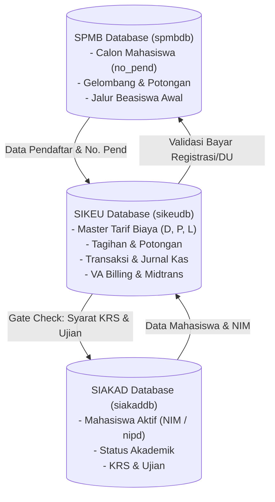
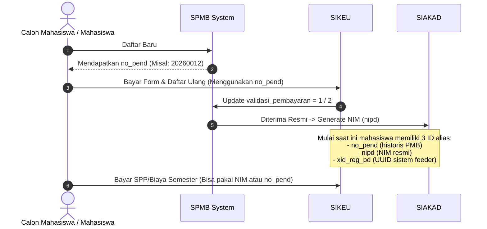
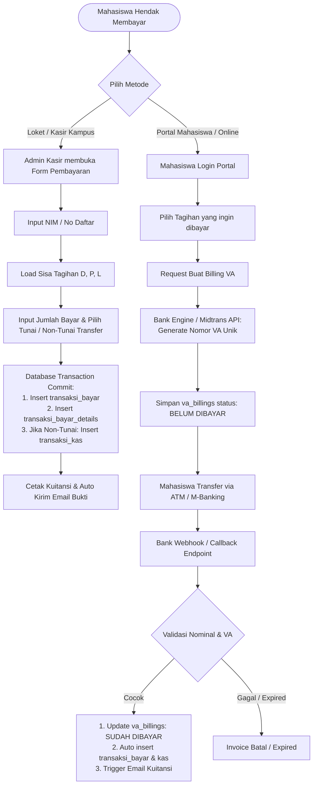
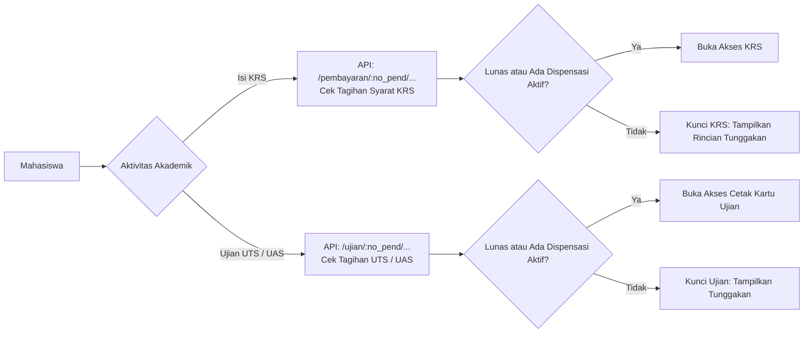

# Panduan & Dokumentasi Arsitektur Flow Pendataan dan Pembayaran Mahasiswa

Dokumen ini menyajikan rangkuman arsitektur, siklus hidup identitas mahasiswa, struktur penagihan, serta alur transaksi pembayaran (online & offline) berdasarkan implementasi pada sistem **SIKEU (Sistem Informasi Keuangan)**. Dokumen ini dirancang sebagai acuan standar rekayasa perangkat lunak untuk diimplementasikan ke sistem baru/lain.

---

## 1. Arsitektur Terintegrasi (Multi-Database Federation)

Sistem keuangan kampus tidak berdiri sendiri, melainkan bertindak sebagai gerbang validasi finansial yang mengintegrasikan **Sistem Penerimaan Mahasiswa Baru (SPMB)** dan **Sistem Informasi Akademik (SIAKAD)**.



### Entitas Utama:
1. **SPMB (`spmbdb` / `daftar_view`)**:
   - Primary Identifier: `no_pend` (Nomor Pendaftaran).
   - Menampung calon mahasiswa, status validasi registrasi (`validasi_pembayaran`), dan jalur beasiswa/gelombang pendaftaran.
2. **SIAKAD (`siakaddb` / `viewMahasiswaPt`)**:
   - Primary Identifier: `nipd` (NIM) & `xid_reg_pd` (ID Registrasi PD).
   - Menampung mahasiswa aktif, program studi, kelas, tahun angkatan, dan status kuliah (Aktif/Lulus/Keluar).
3. **SIKEU (`sikeudb`)**:
   - Basis data transaksi keuangan sentral, pengelompokan akun akuntansi, pencatatan kas/bank, dispensasi, serta penerbitan invoice billing bank/VA.

---

## 2. Siklus Hidup Identitas Mahasiswa (Student Identifier Lifecycle)

Salah satu tantangan utama sistem keuangan akademik adalah **perubahan identitas unik mahasiswa** dari fase calon mahasiswa hingga menjadi mahasiswa aktif.



> **Aturan Multi-Identifier Lookup**:
> Query pencarian riwayat transaksi atau sisa tagihan **selalu** mencari menggunakan kumpulan alias identifier:
> ```sql
> WHERE no_pend IN (no_pend_lama, nipd_nim, xid_reg_pd)
> ```
> Pendekatan ini mencegah tagihan ganda atau data pembayaran pendaftaran hilang ketika mahasiswa telah memiliki NIM.

---

## 3. Struktur & Klasifikasi Master Biaya

Biaya penagihan diklasifikasikan ke dalam 3 jenis kode transaksi (`jenis_biaya`):

| Kode | Kategori | Sumber Tabel Master | Karakteristik & Segmentasi |
| :---: | :--- | :--- | :--- |
| **`D`** | **Biaya PMB / Pendaftaran** | `master_biaya_pmbs` | Dikenakan saat awal masuk (Pendaftaran & Daftar Ulang). Dipetakan per **Tahun Angkatan**, **Kode Prodi**, dan **Jenis Pendaftaran**. |
| **`P`** | **Biaya Pendidikan / Tetap** | `master_biaya_mhs` | Tagihan reguler per **Semester (1 s/d 8)**, Tahun Angkatan, Program Studi, dan Jenis Daftar. Mendukung biaya kondisional mahasiswa tertentu (`tambahan` & `tambahan_mhs`). |
| **`L`** | **Biaya Insidental / Lain-Lain** | `master_biaya_lains` | Biaya non-semester yang ditagihkan sewaktu-waktu (misal: Wisuda, Uji Kompetensi, Cuti Akademik, PKL/Magang). Dipetakan per Prodi dan Angkatan. |

---

## 4. Logika Perhitungan Tagihan & Piutang (Receivables Formula)

Tagihan mahasiswa bersifat dinamis dan dihitung secara akumulatif (*running-balance calculation*):

$$\text{Tagihan Kotor (Gross Tagihan)} = \sum \text{Master Biaya (D, P, L yang berlaku)}$$

$$\text{Total Potongan} = \sum \text{master\_potongans (Diskon Gelombang, Beasiswa, Subsidi)}$$

$$\text{Total Terbayar} = \sum \text{riwayat\_bayar (Transaksi lunas tanpa koreksi)}$$

$$\text{Sisa Piutang (Kekurangan)} = \max\left(0, \, \text{Tagihan Kotor} - \text{Total Potongan} - \text{Total Terbayar}\right)$$

### Aturan Penerima Beasiswa:
1. Mahasiswa dicek silang terhadap:
   - Tabel `sikeu_beasiswa`
   - Kolom `beasiswa` pada `spmb.daftar_view` (misal: "KIP Kuliah", "Prestasi")
   - Data potongan di `master_potongans`
2. Jika terdaftar beasiswa penuh, tagihan pokok disubsidi/dinolkan oleh sistem potongan agar tidak memblokir kegiatan akademik mahasiswa.

---

## 5. Alur Transaksi Pembayaran

Sistem mendukung dua jalur utama: **Offline (Kasir Kampus)** dan **Online (Virtual Account / Gateway)**.



### A. Alur Pembayaran Manual / Kasir (Admin Sisi Kampus)
1. Admin memasukkan `no_pend` atau `nipd`.
2. Sistem merender seluruh sisa kekurangan per komponen biaya.
3. Kasir memilih komponen yang dibayarkan dan nominal bayar.
4. Validasi **Tutup Buku**: Sistem memastikan tanggal transaksi belum mengalami tutup buku bulanan.
5. **Database Transaction (`koneksi.transaction`)**:
   - Simpan header pada `transaksi_bayar` dengan nomor transaksi auto-increment unik (`Prefix-Tgl-Urut`).
   - Simpan item rincian pada `transaksi_bayar_details`.
   - Jika metode **NONTUNAI** (transfer bank langsung ke rekening kampus), sistem otomatis membuat pembukuan kas masuk pada `transaksi_kas` & `transaksi_kas_details`.
   - Jika pembayaran pendaftaran/daftar ulang, sistem memperbarui flag `validasi_pembayaran` di SPMB.
6. Trigger email kuitansi digital terkirim otomatis ke email mahasiswa.

### B. Alur Pembayaran Online (Virtual Account BTN Syariah / Midtrans)
1. Mahasiswa memilih satu atau beberapa tagihan di portal siswa.
2. Sistem memanggil modul billing untuk membuat invoice unik.
3. Nomor VA dibuat dengan format terstandarisasi:
   $$\text{VA Number} = \text{Prefix Bank} + \text{Kode Edu Institusi} + \text{Nomor Pembayaran}$$
4. Invoice berstatus *Pending/Active* tersimpan di `va_billings` dan `va_billing_details`.
5. Saat mahasiswa membayar melalui ATM/Mobile Banking, bank melakukan *hit webhook*:
   - **Inquiry**: Bank menanyakan detail tagihan berdasarkan VA.
   - **Payment Callback (`/invoice/paid`)**: Bank mengirimkan konfirmasi pelunasan beserta nomor referensi (`no_reff_bank`).
6. Sistem memvalidasi nominal, memperbarui status invoice menjadi lunas, dan mencatatkan pembayaran ke sistem akademik secara *real-time*.

---

## 6. Integrasi Kontrol Akademik (Academic Control Gates)

SIKEU terhubung langsung dengan proses akademik di SIAKAD. Mahasiswa hanya diizinkan mengambil layanan akademik jika kewajiban keuangannya terpenuhi:



### Mekanisme Dispensasi Pembayaran (`master_tagihan_dispen`):
- Apabila mahasiswa belum dapat melunasi tagihan tepat waktu namun memiliki alasan sah (misal keterlambatan pencairan beasiswa atau masalah ekonomi), admin keuangan dapat menerbitkan **Surat Dispensasi**.
- Dispensasi menentukan komponen biaya mana yang ditangguhkan dan menetapkan tanggal batas akhir (`tanggal_dispen`).
- Selama tanggal berjalan $\le \text{tanggal\_dispen}$, sistem akan menganggap syarat pembayaran terpenuhi (*temporarily unlocked*), sehingga mahasiswa tetap dapat mengisi KRS atau mengikuti ujian.

---

## 7. Skema Basis Data Inti (Database Blueprint)

Berikut adalah ringkasan skema tabel esensial yang diperlukan untuk mereplikasi sistem ini:

### 1. `master_biaya_pmbs` (Tagihan Calon Mahasiswa)
```sql
CREATE TABLE master_biaya_pmbs (
    id BIGINT AUTO_INCREMENT PRIMARY KEY,
    akun_id INT NOT NULL,
    nama_biaya VARCHAR(255) NOT NULL,
    jumlah DOUBLE NOT NULL,
    tahun_angkatan VARCHAR(10) NOT NULL,
    kode_prodi VARCHAR(20) NOT NULL,
    jenis_daftar INT DEFAULT 1,
    createdAt DATETIME,
    updatedAt DATETIME,
    deletedAt DATETIME
);
```

### 2. `master_biaya_mhs` (Tagihan Semester Mahasiswa)
```sql
CREATE TABLE master_biaya_mhs (
    id BIGINT AUTO_INCREMENT PRIMARY KEY,
    akun_id INT NOT NULL,
    nama_biaya VARCHAR(255) NOT NULL,
    smt INT NOT NULL, -- Semester 1 s/d 8
    jumlah DOUBLE NOT NULL,
    tahun_angkatan VARCHAR(10) NOT NULL,
    kode_prodi VARCHAR(20) NOT NULL,
    jenis_daftar INT DEFAULT 1,
    tambahan TINYINT(1) DEFAULT 0,
    tambahan_mhs TEXT NULL, -- JSON / Comma-separated no_pend khusus
    createdAt DATETIME,
    updatedAt DATETIME,
    deletedAt DATETIME
);
```

### 3. `master_biaya_lains` (Tagihan Biaya Lain-Lain)
```sql
CREATE TABLE master_biaya_lains (
    id BIGINT AUTO_INCREMENT PRIMARY KEY,
    akun_id INT NOT NULL,
    nama_biaya VARCHAR(255) NOT NULL,
    jumlah DOUBLE NOT NULL,
    tahun_angkatan VARCHAR(10) NULL,
    kode_prodi VARCHAR(20) NOT NULL,
    status TINYINT(1) DEFAULT 1,
    createdAt DATETIME,
    updatedAt DATETIME,
    deletedAt DATETIME
);
```

### 4. `master_potongans` (Potongan / Diskon / Subsidi Beasiswa)
```sql
CREATE TABLE master_potongans (
    id BIGINT AUTO_INCREMENT PRIMARY KEY,
    no_pend VARCHAR(50) NOT NULL,
    keterangan VARCHAR(255),
    jenis_potongan VARCHAR(5) NOT NULL, -- 'D', 'P', atau 'L'
    biaya_id BIGINT NOT NULL,
    jumlah_potongan DOUBLE NOT NULL,
    tanggal DATE NOT NULL,
    divisi VARCHAR(50),
    username VARCHAR(100),
    createdAt DATETIME,
    updatedAt DATETIME,
    deletedAt DATETIME
);
```

### 5. `transaksi_bayar` (Header Pembayaran)
```sql
CREATE TABLE transaksi_bayar (
    id BIGINT AUTO_INCREMENT PRIMARY KEY,
    kode VARCHAR(50) UNIQUE NOT NULL,
    kode_bukti VARCHAR(50),
    no_pend VARCHAR(50) NOT NULL,
    keterangan TEXT,
    tanggal DATETIME NOT NULL,
    tanggal_nontunai DATE NULL,
    total DOUBLE NOT NULL,
    metode_bayar VARCHAR(20) NOT NULL, -- 'OFFLINE' / 'NONTUNAI' / 'ONLINE'
    pendaftaran TINYINT(1) DEFAULT 0,
    divisi VARCHAR(50),
    username VARCHAR(100),
    createdAt DATETIME,
    updatedAt DATETIME,
    deletedAt DATETIME
);
```

### 6. `transaksi_bayar_details` (Rincian Item Pembayaran)
```sql
CREATE TABLE transaksi_bayar_details (
    id BIGINT AUTO_INCREMENT PRIMARY KEY,
    transaksi_bayar_id BIGINT NOT NULL,
    jenis_biaya VARCHAR(5) NOT NULL, -- 'D', 'P', 'L'
    biaya_id BIGINT NOT NULL,
    keterangan VARCHAR(255),
    tagihan DOUBLE NOT NULL,
    jumlah_potongan DOUBLE DEFAULT 0,
    jumlah_bayar DOUBLE NOT NULL,
    kekurangan DOUBLE NOT NULL,
    koreksi VARCHAR(50) NULL, -- Referensi transaksi koreksi/batal
    createdAt DATETIME,
    updatedAt DATETIME,
    deletedAt DATETIME,
    FOREIGN KEY (transaksi_bayar_id) REFERENCES transaksi_bayar(id)
);
```

### 7. `riwayat_bayar` (Consolidated Read View)
View MySQL untuk membaca agregat transaksi per item secara cepat:
```sql
CREATE OR REPLACE VIEW riwayat_bayar AS
SELECT 
    tbd.id AS id,
    tb.id AS transaksi_bayar_id,
    tb.kode AS kode,
    tbd.biaya_id AS biaya_id,
    tbd.tagihan AS tagihan,
    tbd.jumlah_potongan AS jumlah_potongan,
    tbd.jumlah_bayar AS jumlah_bayar,
    tbd.kekurangan AS kekurangan,
    tbd.keterangan AS keterangan,
    tb.no_pend AS no_pend,
    tb.kode_bukti AS kode_bukti,
    tb.metode_bayar AS metode_bayar,
    tb.tanggal AS tanggal,
    tb.keterangan AS keterangan_transaksi,
    tbd.jenis_biaya AS jenis_biaya,
    tbd.koreksi AS koreksi,
    tbd.createdAt AS createdAt
FROM transaksi_bayar_details tbd
JOIN transaksi_bayar tb ON tbd.transaksi_bayar_id = tb.id
WHERE tb.deletedAt IS NULL AND tbd.deletedAt IS NULL;
```

---

## 8. Panduan Praktis & Rekomendasi Implementasi pada Sistem Baru

1. **Gunakan Atomic Database Transactions**:
   Pencatatan pembayaran selalu melibatkan minimal 2 tabel (`transaksi_bayar` dan `transaksi_bayar_details`) serta pemutakhiran status kas atau modul registrasi. Wajib dibungkus dalam blok `BEGIN TRANSACTION ... COMMIT / ROLLBACK`.
2. **Jangan Menghapus Data Transaksi Fisik (Gunakan Soft Delete & Jurnal Koreksi)**:
   Jika terjadi salah input oleh kasir, terapkan mekanisme **Koreksi** (mencatat pembalik minus pada detail dengan flag `koreksi`) alih-alih `DELETE` permanen pada database.
3. **Pemisahan Antara Tagihan Master dan Tagihan Transaksional**:
   Tarif biaya master (`master_biaya_mhs`) dapat berubah sewaktu-waktu. Saat pembayaran terjadi, simpan salinan `tagihan`, `potongan`, dan `jumlah_bayar` secara snapshot di `transaksi_bayar_details` agar nilai historis laporan keuangan tidak bergeser di masa depan.
4. **Validasi Cutoff Tutup Buku Bulanan**:
   Cegah penginputan atau pengeditan transaksi bertanggal lampau yang periodenya telah dilaporkan dan ditutup buku (`tutup_buku`).
5. **Dukungan Multi-Tenant / Multi-Divisi**:
   Jika institusi memiliki beberapa kampus cabang atau fakultas independen, sertakan atribut `divisi` dan `kode_prodi` pada setiap transaksi untuk kemudahan agregasi laporan per prodi/kelas.
