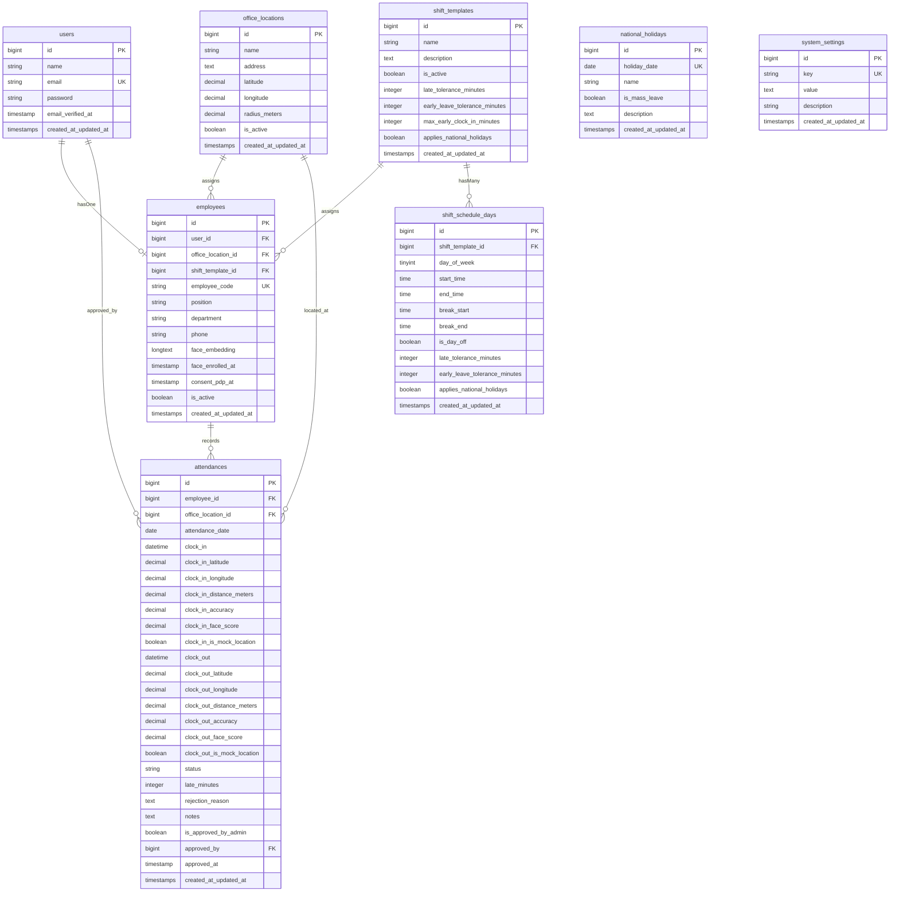

# Blueprint Arsitektur Backend Laravel: Presensi, Biometrik & Integrasi

Dokumen ini adalah **cetak biru teknis lengkap (*Architecture Blueprint*)** yang merangkum seluruh skema database, modul, alur logika, dan file backend Laravel sistem Presensi. Dokumen ini dirancang khusus agar Anda dapat **mencangkokkan / memindahkan seluruh backend presensi ini ke project Laravel lain** secara bersih dan terstruktur.

---

## 1. Daftar Fitur Inti Backend

```
┌─────────────────────────────────────────────────────────────────────────────┐
│                            LARAVEL 11 BACKEND                               │
├───────────────────────────────┬─────────────────────────────────────────────┤
│ 1. Autentikasi & PDP Consent  │ Sanctum Token Mobile, Consent PDP Law       │
│ 2. Biometrik Wajah Multi-Shot │ ArcFace 512-dim, Centroid Vector, Adaptive  │
│ 3. Geofencing & Anti-Fraud    │ Haversine, Mock Location Block, GPS Acc     │
│ 4. Shift & Toleransi Dinamis  │ Shift 5/6 Hari, Toleransi Telat/Pulang Cepat│
│ 5. Libur Nasional Cerdas      │ Sync Kalender Libur, Shift Khusus (Satpam) │
│ 6. Mesin Presensi             │ Clock-in, Clock-out, Rejection Reason Audit │
│ 7. API Integrasi Eksternal    │ Proteksi API Key untuk SIMPEG/RAG/Payroll   │
│ 8. Panel Admin HR (Filament)  │ Rekap Presensi PDF, Override, CRUD Shift    │
└───────────────────────────────┴─────────────────────────────────────────────┘
```

1. **Autentikasi Mobile & Persetujuan PDP**: Login token via Laravel Sanctum dan pencatatan kepatuhan persetujuan pemrosesan data biometrik (`consent_pdp_at`).
2. **Mesin Biometrik Wajah**:
   - Pendaftaran wajah (*multi-shot enrollment*) menghitung *centroid vector* (vektor rata-rata) dari beberapa foto/vektor.
   - *Adaptive Biometric Template Update*: Memperbarui vektor wajah secara otomatis dari presensi sukses harian menggunakan rumus *exponential moving average*.
   - Verifikasi *server-side* terhubung ke Microservice Python (ArcFace ONNX + YuNet).
3. **Geofencing & Anti Fake GPS**:
   - Perhitungan jarak koordinat pengguna terhadap titik kantor menggunakan algoritma **Haversine**.
   - Validasi batas radius kantor (`radius_meters`).
   - Validasi ambang batas akurasi sinyal GPS (`gps_accuracy_threshold_meters`).
   - Penolakan mutlak jika terdeteksi penggunaan GPS Palsu (*Mock Location*).
4. **Jadwal Kerja, Toleransi & Libur Nasional**:
   - Template shift dinamis dengan jadwal harian (Senin - Minggu).
   - Pengaturan toleransi keterlambatan (`late_tolerance_minutes`).
   - Pengaturan pembukaan presensi masuk paling awal (`max_early_clock_in_minutes`).
   - Pengaturan toleransi kepulangan lebih cepat (`early_leave_tolerance_minutes`).
   - Otomasi deteksi hari libur nasional Indonesia (dengan dukungan shift khusus satpam/operasional yang tetap wajib masuk).
5. **API Integrasi Eksternal (API Key)**:
   - Endpoint terproteksi `X-API-KEY` untuk membaca log harian, rentang tanggal, detail audit GPS/wajah, dan rekapitulasi statistik bulanan untuk sistem eksternal (RAG/SIMPEG/Payroll).
6. **Panel Admin Filament 3**:
   - Dashboard pengelolaan karyawan, persetujuan manual absen hari libur, kustomisasi shift, lokasi kantor, kalender libur, pengaturan parameter sistem, dan ekspor laporan PDF.

---

## 2. Dependensi Composer yang Dibutuhkan

Jika dipasang pada project Laravel baru, pastikan paket berikut terpasang:

```bash
composer require laravel/sanctum:^4.0
composer require filament/filament:^3.2
composer require barryvdh/laravel-dompdf:^3.1
```

---

## 3. Skema Database Lengkap (Database Schema & ERD)



### Detail Tabel & Indeks Penting
1. **`attendances`**:
   - Memiliki composite index `['employee_id', 'attendance_date']` untuk kueri riwayat presensi yang instan.
   - Status nilai: `'hadir'`, `'terlambat'`, `'ditolak'`, `'menunggu_approval'`.
2. **`employees`**:
   - `face_embedding`: Bertipe `LONGTEXT` untuk menyimpan array embedding biometrik 512 float ter-serialisasi JSON.
   - `employee_code`: Nomor Induk Pegawai (NIP) bersifat unik.
3. **`system_settings`**:
   - Nilai default penting:
     - `face_score_threshold`: `'0.80'` (atau `0.68` jika ArcFace)
     - `gps_accuracy_threshold_meters`: `'50.0'`
     - `late_tolerance_minutes`: `'15'`
     - `max_early_clock_in_minutes`: `'60'`
     - `early_leave_tolerance_minutes`: `'15'`

---

## 4. Inventaris File yang Harus Disalin (File Manifest)

### A. Migrasi Database (`database/migrations/`)
Salin file migrasi berikut secara berurutan:
1. `2026_09_05_194001_create_office_locations_table.php`
2. `2026_09_05_194002_create_shift_tables.php` (membuat `shift_templates` dan `shift_schedule_days`)
3. `2026_09_05_194003_create_employees_table.php`
4. `2026_09_05_194004_create_attendances_table.php`
5. `2026_09_05_194005_create_system_settings_table.php`
6. `2026_09_08_100001_add_tolerances_to_shift_tables.php`
7. `2026_09_08_100002_add_late_minutes_to_attendances_table.php`
8. `2026_09_08_100003_create_national_holidays_table.php`
9. `2026_09_08_100801_add_applies_national_holidays_to_shift_tables.php`

*(Tips: Jika di project baru, Anda bisa menggabungkan alter table di atas langsung ke migrasi utama).*

---

### B. Eloquent Models (`app/Models/`)
Salin 8 file model:
1. `Attendance.php`: Relasi ke Employee, OfficeLocation, dan User (approver).
2. `Employee.php`: Relasi ke User, OfficeLocation, ShiftTemplate, dan Attendances.
3. `OfficeLocation.php`: Relasi ke Employees dan Attendances.
4. `ShiftTemplate.php`: Relasi `hasMany` ke ShiftScheduleDay dan Employees. Memiliki fungsi `getScheduleForDay()`.
5. `ShiftScheduleDay.php`: Logika pengecekan hari libur, toleransi, dan jam shift.
6. `NationalHoliday.php`: Helper method `isHoliday($date)`.
7. `SystemSetting.php`: Helper method `get($key, $default)` dan `set($key, $value)`.
8. `User.php`: Tambahkan `HasApiTokens` dari Sanctum dan relasi `hasOne(Employee::class)`.

---

### C. Services / Domain Logic (`app/Services/`)
Ini adalah **otak utama** sistem presensi:
1. **`AttendanceService.php`**:
   - Memproses presensi masuk (`processClockIn`) & pulang (`processClockOut`).
   - Memvalidasi Fake GPS, akurasi GPS, geofence radius, biometrik wajah, jam buka shift, dan toleransi shift.
   - Menghitung durasi keterlambatan (`late_minutes`) dan durasi jam kerja (`work_duration_minutes`).
   - Memicu update vektor wajah adaptif (*Adaptive Biometric Update*).
2. **`GeofenceService.php`**:
   - Menghitung jarak 2 titik koordinat bumi (Latitude & Longitude) menggunakan rumus **Haversine**.
3. **`PythonFaceService.php`**:
   - Klien HTTP untuk berkomunikasi dengan microservice Python pengenalan wajah.
4. **`AttendanceRecapService.php`**:
   - Mengolah data rekap kehadiran bulanan, menghitung total hadir, izin, sakit, alpa, keterlambatan, dan jam kerja untuk ekspor PDF.
5. **`HolidaySyncService.php`**:
   - Sinkronisasi hari libur nasional dari API publik Indonesia.
6. **`SimpegSyncService.php`**:
   - Logika sinkronisasi data pegawai dari database eksternal (SIMPEG) ke database presensi.

---

### D. HTTP Controllers & Middleware (`app/Http/`)
1. **`app/Http/Controllers/Api/AuthController.php`**:
   - Endpoint login Sanctum untuk mobile.
   - Endpoint `consent` PDP.
   - Endpoint `enrollFace` (pendaftaran wajah multi-shot) & `resetFace`.
   - Endpoint profil karyawan.
2. **`app/Http/Controllers/Api/AttendanceController.php`**:
   - Endpoint presensi mobile: `todayStatus`, `clockIn`, `clockOut`, `history`, `recap`.
3. **`app/Http/Controllers/Api/AttendanceIntegrationController.php`**:
   - Endpoint akses sistem eksternal: list presensi, detail audit log, rekapitulasi, dan trigger sinkronisasi.
4. **`app/Http/Middleware/ValidateApiKey.php`**:
   - Middleware proteksi endpoint integrasi menggunakan `X-API-KEY`.

---

### E. Filament Admin Panel (`app/Filament/`)
Jika Anda menggunakan Filament di project baru:
1. **Resources (`app/Filament/Resources/`)**:
   - `AttendanceResource.php` (Persetujuan & riwayat absen)
   - `EmployeeResource.php` (Manajemen karyawan, reset biometrik, tombol sync SIMPEG)
   - `ShiftTemplateResource.php` (Manajemen shift & jadwal Senin-Minggu)
   - `OfficeLocationResource.php` (Manajemen lokasi kantor & radius)
   - `NationalHolidayResource.php` (Kalender hari libur)
   - `SystemSettingResource.php` (Konfigurasi parameter)
   - `UserResource.php` (Akun pengguna)
2. **Pages (`app/Filament/Pages/`)**:
   - `RekapPresensi.php` (Halaman preview dan cetak PDF rekapitulasi bulanan)
3. **Views (`resources/views/`)**:
   - `resources/views/pdf/rekap-presensi.blade.php` (Template PDF DomPDF)
   - `resources/views/filament/pages/rekap-presensi.blade.php` (Tampilan tabel Filament)

---

### F. Artisan Commands & Seeders
1. **Commands (`app/Console/Commands/`)**:
   - `SyncHolidaysCommand.php`: Perintah `php artisan holidays:sync`.
   - `SyncSimpegEmployeesCommand.php`: Perintah `php artisan simpeg:sync-employees`.
2. **Seeders (`database/seeders/`)**:
   - `DatabaseSeeder.php`: Menginisialisasi kantor default, shift reguler 5 hari, admin, dan pengaturan sistem awal.
   - `NationalHolidaySeeder.php`: Data hari libur nasional Indonesia 2025 s/d 2027.

---

## 5. Konfigurasi Sistem

### A. Rute API (`routes/api.php`)
Daftarkan seluruh rute di `routes/api.php`:
```php
use App\Http\Controllers\Api\AttendanceController;
use App\Http\Controllers\Api\AttendanceIntegrationController;
use App\Http\Controllers\Api\AuthController;
use Illuminate\Support\Facades\Route;

Route::prefix('v1')->group(function () {
    // 1. Publik
    Route::post('/auth/login', [AuthController::class, 'login']);

    // 2. Mobile Authenticated (Sanctum)
    Route::middleware('auth:sanctum')->group(function () {
        Route::get('/auth/profile', [AuthController::class, 'profile']);
        Route::post('/auth/consent', [AuthController::class, 'recordConsent']);
        Route::post('/auth/enroll-face', [AuthController::class, 'enrollFace']);
        Route::post('/auth/reset-face', [AuthController::class, 'resetFace']);
        Route::post('/auth/logout', [AuthController::class, 'logout']);

        Route::get('/attendance/today', [AttendanceController::class, 'todayStatus']);
        Route::post('/attendance/clock-in', [AttendanceController::class, 'clockIn']);
        Route::post('/attendance/clock-out', [AttendanceController::class, 'clockOut']);
        Route::get('/attendance/history', [AttendanceController::class, 'history']);
        Route::get('/attendance/recap', [AttendanceController::class, 'recap']);
    });

    // 3. Akses Integrasi Sistem Eksternal (API Key)
    Route::middleware('api.key')->prefix('integration')->group(function () {
        Route::get('/attendances', [AttendanceIntegrationController::class, 'index']);
        Route::get('/attendances/recap', [AttendanceIntegrationController::class, 'recap']);
        Route::get('/attendances/{id}', [AttendanceIntegrationController::class, 'show'])->whereNumber('id');
        Route::post('/sync-simpeg', [AttendanceIntegrationController::class, 'syncSimpeg']);
    });
});
```

### B. Konfigurasi Middleware (`bootstrap/app.php`)
Di Laravel 11, daftarkan alias middleware di `bootstrap/app.php`:
```php
->withMiddleware(function (Middleware $middleware) {
    $middleware->alias([
        'api.key' => \App\Http\Middleware\ValidateApiKey::class,
    ]);
})
```

### C. Konfigurasi Layanan (`config/services.php`)
Tambahkan blok konfigurasi face service dan attendance API:
```php
'face_service' => [
    'url' => env('FACE_SERVICE_URL', 'http://127.0.0.1:8001'),
    'timeout' => env('FACE_SERVICE_TIMEOUT', 15),
    'min_similarity' => env('FACE_SERVICE_MIN_SIMILARITY', 0.68),
],

'attendance_api' => [
    'key' => env('ATTENDANCE_API_KEY'),
],
```

### D. Environment Variables (`.env`)
Tambahkan variabel berikut ke file `.env` project baru Anda:
```env
FACE_SERVICE_URL=http://127.0.0.1:8001
FACE_SERVICE_TIMEOUT=15
FACE_SERVICE_MIN_SIMILARITY=0.68

ATTENDANCE_API_KEY=kunci_rahasia_integrasi_anda_disini
RAG_SIMPEG_DB_PATH=/path/ke/database.sqlite
```

---

## 6. Panduan Langkah Demi Langkah Pemindahan (Step-by-Step Porting)

1. **Persiapan Project Baru**:
   - Pastikan project target berjalan dengan Laravel 10 atau 11.
   - Install dependensi composer: `composer require laravel/sanctum filament/filament barryvdh/laravel-dompdf`.
2. **Salin Database Migration & Jalankan Migrate**:
   - Copy file migrasi ke `database/migrations/`.
   - Jalankan `php artisan migrate`.
3. **Salin Models**:
   - Copy semua model dari `app/Models/` ke project target.
   - Pastikan model `User` sudah meng-`use Laravel\Sanctum\HasApiTokens;`.
4. **Salin Services**:
   - Copy folder `app/Services/`.
5. **Salin Controllers & Middleware**:
   - Copy controllers ke `app/Http/Controllers/Api/`.
   - Copy `ValidateApiKey.php` ke `app/Http/Middleware/` dan daftarkan di `bootstrap/app.php`.
6. **Salin Rute**:
   - Tambahkan blok rute di atas ke `routes/api.php`.
7. **Salin Filament Resources & Views (Jika Menggunakan Filament)**:
   - Copy `app/Filament/Resources/` dan `app/Filament/Pages/RekapPresensi.php`.
   - Copy `resources/views/pdf/` dan `resources/views/filament/`.
8. **Inisialisasi Data Awal (Seed)**:
   - Copy `database/seeders/DatabaseSeeder.php` dan `NationalHolidaySeeder.php`.
   - Jalankan: `php artisan db:seed`.
9. **Uji Coba**:
   - Buka web admin `/admin` untuk melihat dashboard Filament.
   - Jalankan `php artisan test` untuk memastikan semua fitur dan logic berjalan sempurna.
