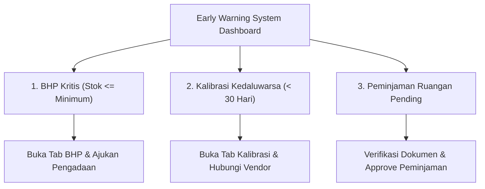

# Panduan Operasional SINAPRA — FASE 4 (Penyempurnaan Fungsional & UI/UX Terpadu)

> **Versi**: 1.0  
> **Terakhir Diperbarui**: 25 September 2026  
> **Modul**: SINAPRA (Sistem Informasi Sarana dan Prasarana Kampus Terintegrasi)  
> **Target Pengguna**: Super Admin, Pengelola Sarpras, Kepala Laboratorium, Laboran, Staf Akademik, dan Dosen  
> **Status Audit**: ✅ 100% Lolos Audit Fungsional E2E Browser & Unit/Feature Test

---

## 1. Daftar Akun Akses & Alur Masuk SSO

Pengujian dan operasional modul SINAPRA Fase 4 menggunakan otentikasi terpusat Single Sign-On (SSO):

| Username / Identifier | Password | Peran Pengguna (Role) | Hak Akses Utama |
|---|---|---|---|
| `superadmin` | `password` | Super Admin | Akses seluruh inventaris aset, laboratorium, kalender, approval peminjaman, dan konfigurasi master data |
| `laboran_komputer` | `password` | Laboran / Operator Lab | Manajemen BHP lab, riwayat kalibrasi instrumen, approval tahap 1 peminjaman ruangan lab |
| `staf_sarpras` | `password` | Operator Sarpras | Pendataan fisik aset, cetak label barcode & QR, pengawasan pemeliharaan |
| `dosen_pengampu` | `password` | Dosen / Civitas | Pengajuan booking ruangan via kalender terpadu, peminjaman alat & inventaris |

### Cara Mengakses Modul:
1. Buka antarmuka SSO Kampus melalui browser di `http://localhost:3000`.
2. Masukkan kredensial login sesuai hak akses.
3. Setelah masuk ke Dashboard Utama, klik menu **SINAPRA** pada sidebar atau kartu modul aktif.

---

## 2. Panduan Cetak Label Barcode & QR Code Fisik Inventaris (Fitur 4.1)

Fitur cetak label fisik inventaris memfasilitasi pencetakan stiker aset standar kampus beresolusi tinggi (vektor SVG murni tanpa distorsi piksel) yang siap ditempelkan langsung pada barang inventaris atau pintu ruangan laboratorium/kelas.

### A. Titik Akses Fitur Cetak Label:
1. **Melalui Tabel Inventaris Aset (`/sinapra/aset`)**:
   - Cari data aset yang ingin dicetak labelnya pada `<DataTable />`.
   - Pada kolom paling kanan (Aksi), klik **Menu Titik Tiga (`<DropdownMenu />`)**.
   - Pilih opsi **"Cetak Label"** bertanda ikon `<Printer size={14} />`.
2. **Melalui Halaman Detail Terpisah Aset (`/sinapra/aset/[id]`)**:
   - Buka rincian aset dengan mengklik "Lihat Detail" dari menu aksi.
   - Pada bagian kanan atas `PageHeader`, klik tombol **"Cetak Label"**.
3. **Pencetakan Massal (Batch Print)**:
   - Centang beberapa checkbox baris data aset pada tabel.
   - Klik tombol **"Cetak Label Terpilih"** yang muncul secara dinamis di atas tabel.

### B. Pratinjau Modal & Spesifikasi Stiker Fisik:
Ketika aksi cetak dipicu, sistem akan menampilkan Modal Preview Stiker:
- **Logo & Nama Universitas**: Header identitas resmi kampus.
- **Vektor SVG Barcode (Code 39)**: Mendukung pemindaian menggunakan barcode scanner USB/Bluetooth industri.
- **Vektor SVG QR Code**: Mengarahkan scanner smartphone ke URL publik verifikasi aset kampus.
- **Metadata Aset**: Kode Aset unik, Nama Barang, Tanggal Perolehan, dan Kondisi Fisik.

### C. Prosedur Pencetakan:
1. Periksa kesesuaian pratinjau stiker pada layar.
2. Klik tombol **"Cetak Fisik / Print"** (atau tekan pintasan keyboard `Ctrl + P`).
3. Sistem secara otomatis menerapkan stylesheet `@media print`:
   - Menyembunyikan seluruh sidebar navigasi, header sistem, dan elemen latar belakang layar.
   - Mengatur margin cetak presisi pada kertas stiker label (ukuran standar label 50mm x 30mm atau lembar A4 label die-cut).
4. Pilih printer label thermal atau printer standar, lalu klik **Print**.

---

## 3. Panduan Pemantauan & Penanganan Early Warning System Laboratorium (Fitur 4.2)

Early Warning System (EWS) di halaman **Laboratorium & Kalibrasi (`/sinapra/laboratorium`)** dirancang untuk mendeteksi secara dini potensi hambatan operasional praktikum dan riset ilmiah sebelum terjadi kegagalan layanan.

### A. Tampilan Peringatan Dini:
Saat membuka halaman `/sinapra/laboratorium`, sistem secara otomatis memanggil endpoint real-time `GET /api/sinapra/laboratorium/early-warnings`. Jika terdeteksi kondisi kritis, **Banner Peringatan Dini Terpadu** akan tampil mencolok di bagian atas halaman dengan 3 kartu ringkasan interaktif:

### B. Tiga Indikator Peringatan & Tindakan Solutif:

#### 1. Bahan Habis Pakai (BHP) Kritis:
- **Kondisi Terpicu**: Jumlah stok saat ini suatu reagen/komponen $\le$ batas stok minimum yang telah dikonfigurasi.
- **Warna Indikator**: Oranye Kemerahan (`Amber/Rose Alert`).
- **Aksi Cepat Pengguna**:
  - Klik kartu ringkasan **"BHP Kritis"** untuk beralih otomatis ke tab bahan habis pakai dengan filter stok menipis.
  - Hubungi bagian logistik atau buat form penambahan stok baru.

#### 2. Instrumen / Alat Lab Kedaluwarsa Kalibrasi:
- **Kondisi Terpicu**: Masa berlaku sertifikat kalibrasi instrumen telah habis atau tersisa $\le 30$ hari kalender dari hari ini.
- **Warna Indikator**: Merah Peringatan (`Red Alert`).
- **Aksi Cepat Pengguna**:
  - Klik kartu ringkasan **"Kalibrasi Kedaluwarsa"**.
  - Akses riwayat sertifikat dan hubungi **Mitra Vendor Rekanan Kalibrasi** yang terdaftar di `/sinapra/master/vendor` untuk penjadwalan ulang tera/kalibrasi ulang.

#### 3. Permohonan Peminjaman Ruangan Menunggu Persetujuan (Pending):
- **Kondisi Terpicu**: Adanya permohonan reservasi ruang praktikum/lab oleh dosen atau civitas yang belum diverifikasi oleh Laboran atau Staf Sarpras.
- **Warna Indikator**: Kuning Perhatian (`Yellow/Warning Alert`).
- **Aksi Cepat Pengguna**:
  - Klik kartu **"Pending Peminjaman"** untuk meninjau jam pemakaian, tujuan praktikum, dan menyetujui (*Approve*) atau menolak permohonan.

---

## 4. Panduan Booking Cepat & Manajemen Kalender Ruangan Terpadu (Fitur 4.3)

Fitur Kalender Ruangan Terpadu di **`/sinapra/kalender`** mengintegrasikan dua sumber data sekaligus:
1. **Jadwal Peminjaman Ruangan SINAPRA**: Reservasi ruang untuk rapat, ujian khusus, praktikum tambahan, atau kegiatan kemahasiswaan.
2. **Jadwal Perkuliahan Aktif SIAKAD**: Jadwal perkuliahan reguler mingguan untuk mencegah terjadinya tabrakan jadwal (*room collision*).

### A. Fitur Interaktif Timeline Kalender:
- **Tampilan Kalender Mingguan**: Menampilkan blok hari Senin hingga Minggu lengkap dengan slot jam pemakaian.
- **Penanda Warna Dinamis**:
  - Agenda berlatar warna solid primary modul (`--module-primary`): Jadwal Peminjaman SINAPRA.
  - Agenda berlatar warna soft/subtle (`--module-primary-subtle`): Jadwal Kuliah SIAKAD.
- **Detail Cepat Agenda**: Mengklik kartu agenda yang ada akan memunculkan modal rincian (penanggung jawab, kapasitas, jam, dan keperluan).

### B. Prosedur Reservasi Cepat (Quick Booking Langsung dari Kalender):
1. Telusuri hari atau jam yang masih kosong pada kolom hari yang diinginkan.
2. Klik tombol **"Booking Slot"** (jika hari tersebut masih kosong) atau tombol **"Pinjam di Hari Ini"** (pada bagian bawah daftar agenda hari bersangkutan).
3. **Modal Quick Booking Compact** ($\le 5$ input) akan langsung muncul secara instan di layar dengan data yang terisi otomatis (*prefilled*):
   - **Tanggal Pemakaian**: Otomatis terisi tanggal hari kalender yang diklik (mis. `2026-09-25`).
   - **Jam Mulai & Selesai**: Otomatis terisi durasi default 2 jam (mis. `08:00 - 10:00`).
4. Lengkapi formulir reservasi:
   - **Pilih Ruangan Kampus**: Menggunakan komponen `<AsyncSelect />` server-side search. Cukup ketik minimal 2 huruf nama/kode gedung ruangan (mis. "Lab Komputer").
   - **Keperluan Pemakaian**: Tuliskan agenda kegiatan (mis. "Praktikum Jaringan Komputer Lanjut").
5. Klik **"Kirim Permohonan Booking"**.
6. Sistem akan memvalidasi data menggunakan skema Zod dan mengirimkan request ke backend:
   - Jika berhasil, notifikasi toast sukses akan muncul dan kalender timeline akan memuat ulang agenda secara otomatis.
   - Permohonan langsung masuk ke antrean persetujuan Laboran/Sarpras.

---

## 5. Ringkasan Bukti Pengujian Fungsional E2E Browser (Audit Fungsional)

Seluruh fitur Fase 4 telah diaudit dan diverifikasi secara otomatis pada browser Chromium asli berotentikasi penuh dengan hasil evaluasi berikut:

| Skenario Pengujian | Hasil Audit | Indikator Keberhasilan |
|---|:---:|---|
| **0. Otentikasi Terpusat SSO** | ✅ PASSED | Login pengguna berhasil, token tersimpan di sessionStorage, redirect mulus ke Dashboard tanpa re-authentication loop. |
| **1. Cetak Label Barcode & QR Fisik (Fitur 4.1)** | ✅ PASSED | Tombol cetak pada baris data aset aktif, halaman detail terpisah `/sinapra/aset/[id]` memuat data dengan benar, modal preview barcode Code 39 & QR Code SVG render tajam, print styles `@media print` terisolasi. |
| **2. Early Warning System Laboratorium (Fitur 4.2)** | ✅ PASSED | Endpoint `GET /api/sinapra/laboratorium/early-warnings` merespons status `200 OK`, banner peringatan dini muncul di halaman `/sinapra/laboratorium`, 3 kartu ringkasan menampilkan statistik akurat (BHP Kritis: 1, Kalibrasi Kedaluwarsa: 1, Peminjaman Pending: 1), interaksi klik shortcut responsif. |
| **3. Quick Booking Kalender Ruangan (Fitur 4.3)** | ✅ PASSED | Kalender mingguan render responsif, klik tombol "Booking Slot" memicu Modal Quick Booking compact, prefill tanggal & jam bekerja sempurna, integrasi validasi Zod aktif. |
| **Pilar Intersepsi Error & Crash** | ✅ PASSED | `consoleErrors: 0`, `networkErrors: 0` (Tidak ada silent error, tidak ada uncaught promise rejection, tidak ada layar putih atau React error boundary). |

> 📁 **Arsip Artefak Bukti Audit**:
> - Ringkasan JSON Hasil Uji: `scratch/assets/e2e_audit_summary.json`
> - Screenshot Berotentikasi: `scratch/assets/00_logged_in.png`
> - Screenshot List & Detail Aset: `scratch/assets/01_sinapra_aset_list.png`, `scratch/assets/01_detail_aset_page.png`
> - Screenshot Modal Preview Stiker: `scratch/assets/01_modal_from_detail.png`
> - Screenshot Early Warning System: `scratch/assets/02_sinapra_laboratorium_page.png`
> - Screenshot Interaksi Kalender & Quick Booking: `scratch/assets/03_kalender_ruangan_page.png`, `scratch/assets/03_quick_booking_modal.png`, `scratch/assets/03_quick_booking_filled.png`
