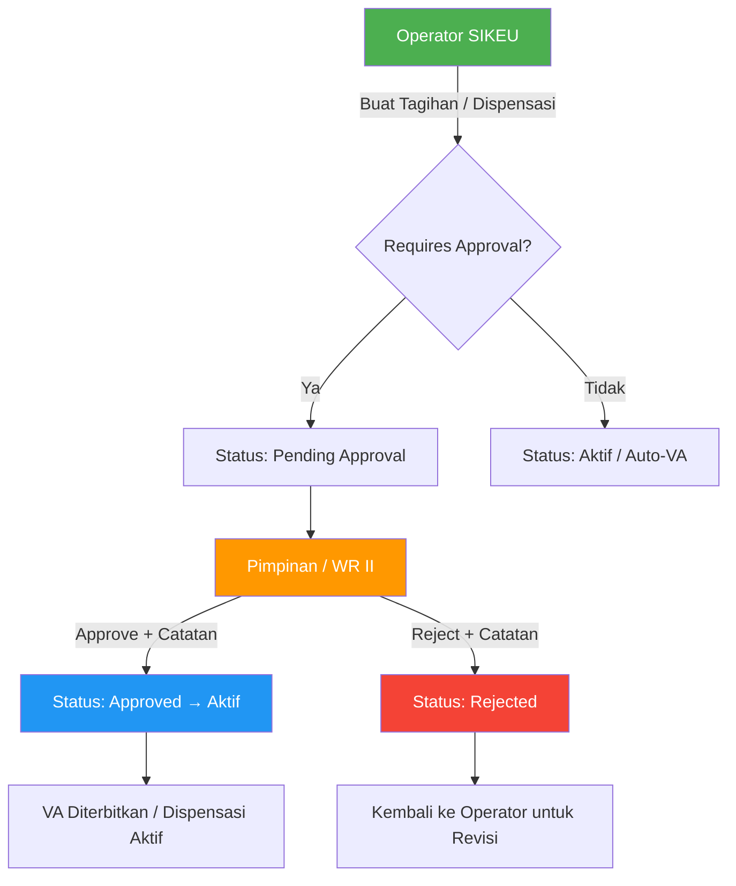

# Peta Role, Permission, & Akses Menu — Modul SIKEU

> **Versi**: 1.0  
> **Terakhir Diperbarui**: 10 September 2026  
> **Modul**: SIKEU — Sistem Informasi Keuangan Kampus

---

## 1. Daftar Role SIKEU

| # | Slug Role | Nama Lengkap | Deskripsi |
|---|---|---|---|
| 1 | `operator_sikeu` | Operator SIKEU / Staf Kasir | Staf keuangan operasional: mengelola master biaya, tagihan, pembayaran kasir, piutang, dispensasi |
| 2 | `kabag_keuangan` | Kepala Bagian Keuangan | Kepala divisi keuangan: semua akses operator + akuntansi, kas utama, tutup buku, pengeluaran, pajak, konfigurasi |
| 3 | `pimpinan` | Pimpinan Kampus / WR II | Wakil Rektor Bidang Keuangan: approval tagihan, approval dispensasi, review laporan |
| 4 | `mahasiswa` | Mahasiswa | Portal mandiri: lihat tagihan, cetak invoice & VA, cek status pembayaran |

---

## 2. Matriks Akses Menu (Halaman Frontend)

| # | Menu / Halaman | Path | `operator_sikeu` | `kabag_keuangan` | `pimpinan` | `mahasiswa` |
|---|---|---|:---:|:---:|:---:|:---:|
| 1 | Dashboard SIKEU | `/sikeu` | ✅ | ✅ | ✅ | ❌ |
| 2 | Master Jenis Biaya | `/sikeu/master` (Tab Jenis Biaya) | ✅ R/W | ✅ R/W | ❌ | ❌ |
| 3 | Setting Tarif | `/sikeu/master` (Tab Setting Tarif) | ✅ R/W | ✅ R/W | ❌ | ❌ |
| 4 | Jalur Kelas | `/sikeu/master` (Tab Jalur Kelas) | ✅ R/W | ✅ R/W | ❌ | ❌ |
| 5 | Beasiswa & Mapping | `/sikeu/master` (Tab Beasiswa) | ✅ R/W | ✅ R/W | ❌ | ❌ |
| 6 | Student Billing Types | `/sikeu/master` (Tab Student Types) | ✅ R/W | ✅ R/W | ❌ | ❌ |
| 7 | Tarif SPMB | `/sikeu/master` (Tab Tarif SPMB) | ✅ R/W | ✅ R/W | ❌ | ❌ |
| 8 | Unit Kas | `/sikeu/unit-kas` | ❌ | ✅ R/W | ❌ | ❌ |
| 9 | Set Tagihan & Invoice | `/sikeu/tagihan` | ✅ R/W | ✅ R/W | ❌ | ❌ |
| 10 | Generate Tagihan Masal | `/sikeu/tagihan` (Modal) | ✅ | ✅ | ❌ | ❌ |
| 11 | Pembayaran Kasir / VA | `/sikeu/tagihan/create` | ✅ | ✅ | ❌ | ❌ |
| 12 | Riwayat Pembayaran | `/sikeu/pembayaran` | ✅ Read | ✅ R/W | ❌ | ❌ |
| 13 | Koreksi Pembayaran | `/sikeu/pembayaran` (Action) | ⚠️ | ✅ | ❌ | ❌ |
| 14 | Piutang Mahasiswa | `/sikeu/piutang` | ✅ Read | ✅ Read | ❌ | ❌ |
| 15 | Export Piutang Excel | `/sikeu/piutang` (Tombol Export) | ✅ | ✅ | ❌ | ❌ |
| 16 | Dispensasi | `/sikeu/dispensasi` | ✅ R/W | ✅ R/W | ❌ | ❌ |
| 17 | Approval Tagihan | `/sikeu/approval` | ❌ | ⚠️ Read | ✅ Approve/Reject | ❌ |
| 18 | Approval Dispensasi | `/sikeu/approval` | ❌ | ⚠️ Read | ✅ Approve/Reject | ❌ |
| 19 | Akuntansi — COA | `/sikeu/akuntansi/coa` | ❌ | ✅ R/W | ❌ | ❌ |
| 20 | Akuntansi — Jurnal Umum | `/sikeu/akuntansi/jurnal` | ❌ | ✅ R/W | ❌ | ❌ |
| 21 | Akuntansi — Buku Besar | `/sikeu/akuntansi/buku-besar` | ❌ | ✅ Read | ❌ | ❌ |
| 22 | Akuntansi — Laporan | `/sikeu/akuntansi/laporan` | ❌ | ✅ Read | ✅ Read | ❌ |
| 23 | Pemasukan Kampus | `/sikeu/pemasukan` | ❌ | ✅ R/W | ❌ | ❌ |
| 24 | Pengeluaran Kampus | `/sikeu/pengeluaran` | ❌ | ✅ R/W | ❌ | ❌ |
| 25 | Pajak Kampus | `/sikeu/pajak` | ❌ | ✅ R/W | ❌ | ❌ |
| 26 | Payment Gateway | `/sikeu/payment-gateway` | ❌ | ✅ R/W | ❌ | ❌ |
| 27 | Kas Kabag Keuangan | `/sikeu/kabag` | ❌ | ✅ R/W | ❌ | ❌ |
| 28 | Portal Tagihan Mandiri | `/sikeu/mahasiswa/tagihan` | ❌ | ❌ | ❌ | ✅ |
| 29 | Cetak Invoice & VA | `/sikeu/mahasiswa/tagihan` (Modal) | ❌ | ❌ | ❌ | ✅ |

**Legenda**:
- ✅ R/W = Bisa baca dan tulis (CRUD)
- ✅ Read = Hanya bisa baca (lihat data)
- ⚠️ = Akses terbatas / kondisional
- ❌ = Tidak punya akses

---

## 3. Matriks Akses API Endpoint

### Endpoints Master & Konfigurasi

| # | Endpoint | Method | `operator_sikeu` | `kabag_keuangan` | `pimpinan` | `mahasiswa` |
|---|---|---|:---:|:---:|:---:|:---:|
| 1 | `/v1/sikeu/master/master-biaya` | GET | ✅ | ✅ | ❌ | ❌ |
| 2 | `/v1/sikeu/master/master-biaya` | POST | ✅ | ✅ | ❌ | ❌ |
| 3 | `/v1/sikeu/master/master-biaya/{id}` | PUT | ✅ | ✅ | ❌ | ❌ |
| 4 | `/v1/sikeu/master/master-biaya/{id}` | DELETE | ❌ | ✅ | ❌ | ❌ |
| 5 | `/v1/sikeu/master/setting-tarif` | GET | ✅ | ✅ | ❌ | ❌ |
| 6 | `/v1/sikeu/master/setting-tarif` | POST | ✅ | ✅ | ❌ | ❌ |
| 7 | `/v1/sikeu/master/setting-tarif/{id}` | PUT | ✅ | ✅ | ❌ | ❌ |
| 8 | `/v1/sikeu/master/setting-tarif/{id}` | DELETE | ❌ | ✅ | ❌ | ❌ |
| 9 | `/v1/sikeu/master/jalur-kelas` | GET/POST/PUT/DELETE | ✅ | ✅ | ❌ | ❌ |
| 10 | `/v1/sikeu/master/beasiswa` | GET/POST/PUT/DELETE | ✅ | ✅ | ❌ | ❌ |
| 11 | `/v1/sikeu/master/unit-kas` | GET/POST/PUT/DELETE | ❌ | ✅ | ❌ | ❌ |

### Endpoints Tagihan & Pembayaran

| # | Endpoint | Method | `operator_sikeu` | `kabag_keuangan` | `pimpinan` | `mahasiswa` |
|---|---|---|:---:|:---:|:---:|:---:|
| 12 | `/v1/sikeu/tagihan/external` | POST | ✅ | ✅ | ❌ | ❌ |
| 13 | `/v1/sikeu/tagihan/generate-mass` | POST | ✅ | ✅ | ❌ | ❌ |
| 14 | `/v1/sikeu/pembayaran/kasir` | POST | ✅ | ✅ | ❌ | ❌ |
| 15 | `/v1/sikeu/pembayaran/{id}/koreksi` | POST | ⚠️ | ✅ | ❌ | ❌ |
| 16 | `/v1/sikeu/pembayaran` | GET | ✅ | ✅ | ❌ | ❌ |
| 17 | `/v1/sikeu/piutang` | GET | ✅ | ✅ | ❌ | ❌ |
| 18 | `/v1/sikeu/piutang/export-excel` | GET | ✅ | ✅ | ❌ | ❌ |

### Endpoints Dispensasi & Approval

| # | Endpoint | Method | `operator_sikeu` | `kabag_keuangan` | `pimpinan` | `mahasiswa` |
|---|---|---|:---:|:---:|:---:|:---:|
| 19 | `/v1/sikeu/dispensasi` | GET/POST | ✅ | ✅ | ❌ | ❌ |
| 20 | `/v1/sikeu/dispensasi/{id}/cetak-bukti` | GET | ✅ | ✅ | ❌ | ❌ |
| 21 | `/v1/sikeu/approvals` | GET | ❌ | ⚠️ | ✅ | ❌ |
| 22 | `/v1/sikeu/approvals/tagihan/{id}/approve` | POST | ❌ | ❌ | ✅ | ❌ |
| 23 | `/v1/sikeu/approvals/tagihan/{id}/reject` | POST | ❌ | ❌ | ✅ | ❌ |
| 24 | `/v1/sikeu/approvals/dispensasi/{id}/approve` | POST | ❌ | ❌ | ✅ | ❌ |
| 25 | `/v1/sikeu/approvals/dispensasi/{id}/reject` | POST | ❌ | ❌ | ✅ | ❌ |

### Endpoints Akuntansi & Keuangan

| # | Endpoint | Method | `operator_sikeu` | `kabag_keuangan` | `pimpinan` | `mahasiswa` |
|---|---|---|:---:|:---:|:---:|:---:|
| 26 | `/v1/sikeu/akuntansi/coa` | GET/POST | ❌ | ✅ | ❌ | ❌ |
| 27 | `/v1/sikeu/akuntansi/jurnal` | GET/POST | ❌ | ✅ | ❌ | ❌ |
| 28 | `/v1/sikeu/akuntansi/buku-besar` | GET | ❌ | ✅ | ✅ Read | ❌ |
| 29 | `/v1/sikeu/pemasukan` | GET/POST | ❌ | ✅ | ❌ | ❌ |
| 30 | `/v1/sikeu/pengeluaran` | GET/POST | ❌ | ✅ | ❌ | ❌ |
| 31 | `/v1/sikeu/pajak` | GET | ❌ | ✅ | ❌ | ❌ |
| 32 | `/v1/sikeu/pajak/{id}/setor` | POST | ❌ | ✅ | ❌ | ❌ |

### Endpoints Portal Mahasiswa

| # | Endpoint | Method | `operator_sikeu` | `kabag_keuangan` | `pimpinan` | `mahasiswa` |
|---|---|---|:---:|:---:|:---:|:---:|
| 33 | `/v1/sikeu/mahasiswa/tagihan` | GET | ❌ | ❌ | ❌ | ✅ |
| 34 | `/v1/sikeu/mahasiswa/invoice/{id}` | GET | ❌ | ❌ | ❌ | ✅ |

---

## 4. Alur Approval (Workflow)

### Detail Alur:
1. **Operator SIKEU** membuat tagihan (atau pengajuan dispensasi)
2. Jika tagihan memerlukan approval → status = **Pending Approval**
3. **Pimpinan** (role `pimpinan`) mereview di `/sikeu/approval`
4. Pimpinan klik **Approve** (+ catatan opsional) → tagihan aktif, VA diterbitkan
5. Pimpinan klik **Reject** (+ catatan wajib) → tagihan ditolak, operator bisa revisi

---

## 5. Rekomendasi Konfigurasi di SSO Admin

Untuk mengkonfigurasi role SIKEU pada user baru:

### Langkah via SSO Admin Panel:
1. Login sebagai **Super Admin** (`superadmin@kampus.ac.id`)
2. Buka menu **SSO → Manajemen User**
3. Cari user yang akan diberi role
4. Klik **"Edit Roles"** atau **"Assign Role"**
5. Pilih role yang sesuai:
   - `operator_sikeu` — untuk staf kasir / keuangan operasional
   - `kabag_keuangan` — untuk Kepala Bagian Keuangan
   - `pimpinan` — untuk WR II / pimpinan bidang keuangan
6. Simpan perubahan

### Tips:
- Satu user **boleh memiliki lebih dari satu role** (multi-role)
- Contoh: User dapat memiliki role `kabag_keuangan` + `operator_sikeu` secara bersamaan
- Role `mahasiswa` biasanya ditetapkan otomatis saat registrasi via SPMB

---

## 6. Catatan Keamanan

| Aspek | Implementasi |
|---|---|
| Autentikasi | Bearer Token (Laravel Sanctum) |
| Otorisasi | Role-Based Access Control (RBAC) via `core_user_roles` |
| Session | Token-based, expire setelah idle timeout |
| Audit Trail | Semua aksi CRUD tercatat di tabel `audit_logs` |
| Tutup Buku | Periode akuntansi yang ditutup mencegah transaksi backdated |
| Koreksi | Tidak ada hard-delete pembayaran; digunakan jurnal pembalik |
