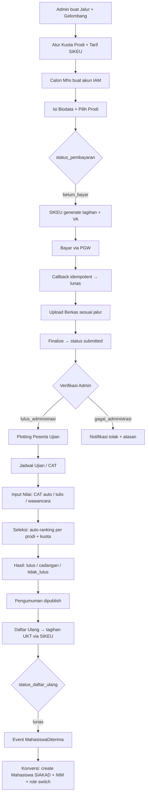

# Rancangan Pengembangan Modul SPMB — Ekosistem Kampus Terintegrasi

> **Status**: DRAFT — untuk review sebelum implementasi
> **Referensi**: ERD Part 1 (SPMB/IAM/SIAKAD), ERD Part 4 (Arsitektur), `module-management-standard`, `implementation_plan_sikeu.md`
> **Lingkup**: Backend Laravel (`integrated_sistem_backend`) + Frontend Next.js (`RAGIFrontend`)

---

## 1. Tujuan & Prinsip Rancangan

Membangun ulang/melengkapi modul **SPMB (Sistem Penerimaan Mahasiswa Baru)** agar:

1. **Siap operasional kampus besar** — ribuan pendaftar, banyak gelombang/jalur berjalan paralel, ujian CBT massal, periode deadline dengan lonjakan traffic.
2. **Terintegrasi penuh** dengan IAM (auth & RBAC), SIKEU (tagihan & payment gateway), SIAKAD (prodi, tahun akademik, konversi NIM), Audit Log, dan Notifikasi.
3. **Sesuai standar ekosistem**: Master Modul dinamis, Service Layer, Event-Driven, FormRequest, PHP Enum, Audit Log, RBAC permission (`spmb.*`).
4. **Data terpercaya**: status machine terpusat, idempotency pembayaran, nomor unik tahan race-condition, history perubahan status.

---

## 2. Assessment Kondisi Saat Ini (Gap Analysis)

### 2.1 Yang Sudah Ada & Bisa Direuse

| Layer | Komponen | Kondisi |
|---|---|---|
| DB | 17 tabel SPMB (`jalur_masuk` → `konversi_mahasiswa`, `spmb_kuota_prodi`) + `tarif_spmb` (SIKEU) + ekstensi `tagihan_mahasiswa` | ✅ Migrasi sudah jalan |
| Backend | 8 controller (`MasterSpmb`, `Pendaftaran`, `CalonMahasiswa`, `AdminSeleksi`, `SpmbKuotaProdi`, `JadwalUjian`, `DaftarUlang`, `LaporanSpmb`) | ✅ Dasar ada |
| Backend | 3 service (`SpmbPendaftaranService`, `SpmbKonversiService`, `SpmbSikeuService`) | ⚠️ Konversi masih mock |
| Backend | Event/Listener (`PembayaranSpmbLunas`, `MahasiswaDiterima`, `UpdateStatusPembayaranSpmb`, `ProsesKonversiMahasiswa`) | ✅ Pola sudah benar |
| Backend | Observers audit (`PendaftaranCalonMhs`, `GelombangPenerimaan`) | ⚠️ API `record()` vs `log()` tidak konsisten |
| Frontend | Route `app/(main)/spmb/*` (dashboard, registrasi, pendaftar, pendaftaran, ujian/jadwal, ujian/peserta, master/*, seleksi/daftar-ulang) | ⚠️ `seleksi` & `ujian` masih placeholder |
| Frontend | `spmb.service.ts`, `sikeu.service.ts`, store Zustand, middleware subdomain `spmb.*` | ✅ |

### 2.2 GAP / Masalah yang Harus Diperbaiki

| # | Gap | Dampak | Solusi di Rancangan |
|---|---|---|---|
| G1 | **Duplikasi tabel berkas**: `dokumen_pendaftaran` dan `pendaftaran_berkas` tumpang tindih | Data dokumen pecah, verifikasi ambigu | Gabung ke satu tabel `dokumen_pendaftaran` + tabel `berkas_requirement` (syarat per jalur) |
| G2 | **Konversi mahasiswa di-mock** (`$mahasiswaId = 1`, SIAKAD dikomentari) | NIM palsu, data mahasiswa tidak masuk SIAKAD | Implementasi nyata via `MahasiswaService` SIAKAD + role switch calon_mhs → mahasiswa |
| G3 | **UKT daftar ulang hardcoded `5000000`** | Salah tarif per prodi/jalur/gelombang | Lookup `tarif_ukt`/`tarif_spmb` dari SIKEU |
| G4 | **Tanpa FormRequest** — validasi inline di controller | Validasi tidak terpusat, tidak reusable | Semua endpoint pakai `app/Http/Requests/Spmb/*` |
| G5 | **Tanpa PHP Enum** — status string mentah | Typo, refactor sulit, switch-case rentan | `app/Enums/Spmb/*` + cast di model |
| G6 | **Tanpa RBAC middleware khusus SPMB** — semua `auth:api` polos | Calon mhs bisa akses endpoint admin | Gate/Policy + permission `spmb.*` per aksi |
| G7 | **`pembayaran_spmb` tidak terpakai** — alur lewat `tagihan_mahasiswa` SIKEU | 2 sumber kebenaran pembayaran | Jadikan *mirror snapshot* status (read-only dari callback), bukan sumber utama |
| G8 | **Tidak ada riwayat status pendaftaran** | Tidak bisa telusur "kapan diverifikasi, oleh siapa" | Tabel `spmb_status_history` (append-only) |
| G9 | **Ujian hanya jadwal+peserta** — tidak ada engine CAT | Tidak bisa ujian massal terkomputerisasi | Engine CAT: `mata_uji`, `soal_cat`, `paket_soal`, `jawaban_cat`, auto-grading |
| G10 | **Seleksi manual** — tanpa auto-ranking & cadangan | Ribuan peserta tidak feasible di-ranking manual | `SpmbSeleksiService`: auto-ranking, kuota, cadangan auto-promote |
| G11 | **Tanpa notifikasi** ke calon mhs (email/WA) | Calon tidak tahu status | Event → queue → notifikasi (email/WA gateway) |
| G12 | **Tanpa SLA/pengawasan verifikasi** | Verifikasi menumpuk di deadline | Dashboard antrian verifikasi + filter umur berkas |

---

## 3. Arsitektur Target

```
┌─────────────────────────────────────────────────────────────┐
│                   FRONTEND (Next.js)                        │
│  spmb.domain.ac.id → app/(main)/spmb/*                     │
│  Portal Calon Mhs  │  Panel Panitia  │  Pengawas Ujian     │
└──────────┬──────────────────────────────────────────────────┘
           │ HTTP + Bearer (axios lib, auto-refresh)
┌──────────▼──────────────────────────────────────────────────┐
│                 BACKEND (Laravel API)                       │
│  routes/api.php → prefix /spmb  (+ /v1/sikeu/spmb/*)       │
│                                                            │
│  Controller → FormRequest → Service (logika bisnis)         │
│  Service → Model (cast enum) → DB                          │
│  Service → Event/Listener (queue) → modul lain             │
└──────┬────────────┬────────────────────┬────────────────────┘
       │            │                    │
   ┌───▼───┐   ┌────▼─────┐        ┌─────▼──────┐
   │  IAM  │   │  SIKEU   │        │   SIAKAD   │
   │ auth/ │   │ tarif +  │        │ prodi, TA, │
   │ RBAC  │   │ tagihan +│        │ mahasiswa, │
   │ SSO   │   │ PGW      │        │ NIM        │
   └───────┘   └──────────┘        └────────────┘
```

**Lapisan kode (Backend):**
- `app/Enums/Spmb/*` — status machine (single source of truth)
- `app/Http/Requests/Spmb/*` — validasi
- `app/Services/Spmb/*` — logika bisnis (controller tipis)
- `app/Http/Controllers/API/Spmb/*` — endpoint + RBAC gate
- `app/Events/Spmb/*` + `app/Listeners/Spmb/*` — integrasi async
- `app/Observers/Spmb/*` — audit log konsisten

---

## 4. Alur Bisnis End-to-End (Status Machine)



**Status machine terpusat (Enum + Service):**

| Entitas | Transisi Status |
|---|---|
| `PendaftaranCalonMhs.status` | `draft → submitted → verified → lulus_administrasi / gagal_administrasi` |
| `PendaftaranCalonMhs.status_pembayaran` | `belum_bayar → lunas / gratis` |
| `HasilSeleksi.status` | `lulus / cadangan / tidak_lulus / mengundurkan_diri` |
| `HasilSeleksi.status_daftar_ulang` | `belum → menunggu_pembayaran → lunas` |
| `GelombangPenerimaan.status` | `draft → aktif → ditutup → selesai` (auto-guard tanggal) |
| `PembayaranSpmb.status` (mirror) | `pending → paid / failed / refunded` (dari callback SIKEU) |

Setiap transisi: **audit log** + **notifikasi** + **riwayat status** (`spmb_status_history`).

---

## 5. Perubahan Skema Database

> Prinsip: migrasi **tanpa `migrate:fresh`** (sesuai kebijakan repo). Semua migrasi additive + backfill.

### 5.1 Tabel Existing yang Dirapikan

| Tabel | Perubahan |
|---|---|
| `pendaftaran_calon_mhs` | Tambah `jalur_masuk_id` (denormalisasi agar filter jalur cepat); cast enum; index `(gelombang_id, status)`, `(program_studi_id, status)`. Pertahankan `no_pendaftaran`, `nik` UNIQUE |
| `dokumen_pendaftaran` | **Serap `pendaftaran_berkas`** (migrasi data + drop tabel); tambah `berkas_requirement_id` FK; `is_verified` + `verified_by` + `verified_at` + `catatan` |
| `pembayaran_spmb` | Pertegas peran: mirror status dari `tagihan_mahasiswa` (diupdate oleh listener callback). Tidak ada insert manual |
| `jadwal_ujian_spmb` | Tambah tipe `cat` pada enum `tipe_ujian`; tambah `kode_sesi` |
| `peserta_ujian_spmb` | `no_peserta` di-generate service (race-safe); tambah `status` (`terjadwal/hadir/tidak_hadir`), `waktu_mulai`, `waktu_selesai` (untuk CAT) |
| `hasil_seleksi` | Sudah ada `status_daftar_ulang`; tambah `kuota_asal` (snapshot kuota saat penetapan) |
| `gelombang_penerimaan` | Tambah `tanggal_pengumuman_real` (untuk kontrol publish) |

### 5.2 Tabel Baru

| Tabel | Tujuan | Kolom Kunci |
|---|---|---|
| `spmb_status_history` | Riwayat append-only tiap perubahan status pendaftaran | `pendaftaran_id`, `status_lama`, `status_baru`, `actor_id`, `catatan`, `created_at` |
| `berkas_requirement` | Syarat berkas per jalur masuk (konfigurasi verifikasi) | `jalur_masuk_id`, `jenis_dokumen`, `wajib`, `urutan`, `is_active` |
| `mata_uji_cat` | Mata uji per gelombang (mis. TPA, TPS, B. Inggris) | `gelombang_id`, `nama`, `durasi_menit`, `jumlah_soal`, `bobot_persen`, `is_active` |
| `soal_cat` | Bank soal | `mata_uji_id`, `tipe` (pg/bener_salah/isian), `pertanyaan`, `opsi` (JSON), `kunci` (hash), `bobot` |
| `paket_soal_cat` | Paket per sesi (pengacakan soal per peserta) | `sesi_ujian_id`, `peserta_ujian_id`, `soal_ids` (JSON urut acak), `waktu_mulai` |
| `jawaban_cat` | Jawaban per soal | `paket_soal_id`, `soal_id`, `jawaban`, `ragu_ragu`, `dinilai_at` |
| `hasil_cat` | Skor per mata uji | `peserta_ujian_id`, `mata_uji_id`, `jumlah_benar`, `skor`, `skor_akhir` (×bobot) |
| `pengawas_ujian` | Assignment pengawas per sesi (RBAC pengawas) | `jadwal_ujian_id`, `pegawai_id`, `peran` (kepala/anggota) |
| `slot_wawancara` | Janji temu wawancara per peserta | `jadwal_ujian_id`, `peserta_ujian_id`, `pegawai_id` (pewawancara), `waktu_mulai`, `status` |

> **CBT untuk kampus besar**: peserta dapat `paket_soal_cat` yang **diacak dari bank soal** per sesi → anti-mencontek massal; `jawaban_cat` append-only; skoring otomatis via `SpmbCatService` (nullable saat sesi berlangsung, final saat submit).

---

## 6. Integrasi Antar Modul

| # | Modul | Arah | Mekanisme | Detail |
|---|---|---|---|---|
| I1 | **IAM** | SPMB → IAM | FK `user_id`, role | Calon mhs register via `/auth/register` (sudah ada); saat konversi → role switch `calon_mhs` → `mahasiswa` (fix TODO) |
| I2 | **IAM** | RBAC | Gate/Policy | Semua endpoint SPMB di-gate permission `spmb.*` sesuai role |
| I3 | **SIKEU** | SPMB → SIKEU | `SpmbSikeuService` | Lookup `tarif_spmb` saat registrasi (existing) |
| I4 | **SIKEU** | SPMB → SIKEU | `ExternalTagihanController@createExternalBill` | Generate tagihan formulir + VA (existing) |
| I5 | **SIKEU** | SIKEU → SPMB | Callback + Event `PembayaranSpmbLunas` | Update `status_pembayaran` → lunas (existing, pastikan **idempotent**: UNIQUE `callback_payment_gateway.order_id` sudah ada) |
| I6 | **SIKEU** | SPMB → SIKEU | `DaftarUlangService` | Generate tagihan UKT semester 1 — **ganti hardcode** dengan lookup `tarif_ukt` (per prodi + kelompok) |
| I7 | **SIAKAD** | SPMB → SIAKAD | Event `MahasiswaDiterima` → `SpmbKonversiService` | **Fix mock**: buat `mahasiswa` (NIM dari `MahasiswaService`), `konversi_mahasiswa`, role switch — via queue `spmb` |
| I8 | **SIAKAD** | Read-only | Model `Siakad\ProgramStudi`, `Siakad\TahunAkademik` | Pastikan model+migrasi SIAKAD prodi/TA ada (G2 blocker) |
| I9 | **Audit** | Semua | Observers + `AuditLogService` | Standarisasi API `record()` di semua observer SPMB (fix inkonsistensi G8) |
| I10 | **Notifikasi** | SPMB → email/WA | Event → Listener queue | Kirim status: berkas diterima/tolak, jadwal ujian, hasil, daftar ulang (gateway via queue, lib pending) |

**Event Map (sesuai ERD Part 4 §9):**
- `spmb.pendaftaran.submitted` → Notifikasi
- `spmb.pembayaran.lunas` → SPMB (status) + Notifikasi
- `spmb.lulus_seleksi` → Notifikasi pengumuman
- `spmb.mahasiswa.diterima` (existing `MahasiswaDiterima`) → SIAKAD konversi + IAM role switch
- `spmb.ujian.selesai` → auto-grading CAT

---

## 7. RBAC & Permissions

### 7.1 Role

| Role | Hak Akses |
|---|---|
| `calon_mhs` (existing) | Registrasi, biodata, upload berkas, cek status, daftar ulang |
| `admin-spmb` / `operator-spmb` (existing) | Master jalur/gelombang/kuota, verifikasi, kelola ujian, seleksi |
| `validator-spmb` *(baru)* | Hanya verifikasi berkas (G12: antrian verifikasi terpisah) |
| `pengawas-ujian` *(baru)* | Lihat sesi yang di-assign + rekap kehadiran + monitor CAT |
| `pimpinan` (existing SIKEU) | Laporan & statistik read-only |

### 7.2 Permission (slug `spmb.*`)

```
spmb.dashboard.read
spmb.master.read | spmb.master.jalur.{create,update,delete} | spmb.master.gelombang.{...} | spmb.master.kuota.{...}
spmb.pendaftaran.read | spmb.pendaftaran.verify | spmb.berkas.verify
spmb.ujian.kelola | spmb.ujian.assign_peserta | spmb.ujian.rekap_hadir
spmb.cat.kelola_soal | spmb.cat.mulai_sesi | spmb.cat.skor
spmb.seleksi.input_nilai | spmb.seleksi.tetapkan_kelulusan | spmb.seleksi.publish_pengumuman
spmb.daftarulang.generate_tagihan | spmb.daftarulang.konfirmasi
spmb.konversi.execute
spmb.laporan.read | spmb.laporan.export
```

Semua di-seed via `PermissionSeeder`/`MenuSeeder` (modul `spmb` sudah terdaftar di `ModuleSeeder`).

---

## 8. Struktur Backend (File Plan)

```
app/Enums/Spmb/
  StatusPendaftaran.php | StatusPembayaran.php | StatusHasilSeleksi.php
  StatusDaftarUlang.php | StatusGelombang.php | TipeJalurMasuk.php
  TipeUjian.php | KomponenNilai.php | JenisDokumen.php

app/Http/Requests/Spmb/
  StoreJalurRequest | UpdateGelombangRequest | StoreBiodataRequest
  FinalizePendaftaranRequest | UploadBerkasRequest | VerifyBerkasRequest
  SetKelulusanRequest | StoreJadwalUjianRequest | AssignPesertaRequest
  GenerateDaftarUlangRequest | StoreSoalRequest | MulaiSesiCatRequest

app/Services/Spmb/
  SpmbNomorService.php          [NEW] no_pendaftaran & no_peserta (race-safe, format THN-JLR-GLB-XXXX)
  SpmbPendaftaranService.php    [EXTEND] submit → finalize → submit-event
  SpmbVerifikasiService.php     [NEW] verify berkas per berkas_requirement, SLA, antrian
  SpmbUjianService.php          [NEW] plotting otomatis, rekap hadir
  SpmbCatService.php            [NEW] bank soal, paket acak, mulai/skor sesi
  SpmbSeleksiService.php        [NEW] auto-ranking per prodi, kuota, cadangan auto-promote
  SpmbDaftarUlangService.php    [NEW] tagihan UKT (lookup tarif_ukt), konfirmasi
  SpmbKonversiService.php       [FIX] integrasi SIAKAD nyata + role switch + queue

app/Http/Controllers/API/Spmb/
  MasterSpmbController.php      [EXTEND] + auto-status gelombang
  CalonMahasiswaController.php  [EXTEND]
  PendaftaranController.php     [EXTEND] + riwayat status
  VerifikasiBerkasController.php [NEW]
  JadwalUjianController.php     [EXTEND] + plotting otomatis
  CatController.php             [NEW] kelola soal, sesi, skor
  PengawasUjianController.php   [NEW]
  SeleksiController.php         [NEW] input nilai, ranking, tetapkan kelulusan
  PengumumanController.php      [NEW] CRUD + publish
  DaftarUlangController.php     [EXTEND] via service
  KonversiController.php        [NEW] trigger/cek status konversi
  LaporanSpmbController.php     [EXTEND] + dashboard SLA, laporan per gelombang

app/Events/Spmb/ + app/Listeners/Spmb/
  PendaftaranSubmitted | PembayaranSpmbLunas (existing) | UjianSelesai
  LulusSeleksi | MahasiswaDiterima (existing) | BerkasDiverifikasi

routes/api.php → semua endpoint baru under prefix /spmb (auth:api + gate)
```

**No. Pendaftaran (race-safe):** generate via `DB::transaction` + `lockForUpdate` pada counter gelombang, atau sequence DB — mencegah nomor ganda saat 1000+ submit bersamaan.

---

## 9. Struktur Frontend (File Plan)

```
app/(main)/spmb/
  dashboard/                      [EXTEND] + SLA verifikasi, kuota realtime
  registrasi/                     [EXTEND] + step wizard (biodata → bayar → berkas → finalize)
  pendaftar/                      [EXTEND] antrian verifikasi + filter SLA
  pendaftaran/                    [EXTEND] + detail & riwayat status
  ujian/
    jadwal/  peserta/             [EXTEND]
    cat/
      soal/page.tsx               [NEW] bank soal per mata uji
      sesi/page.tsx               [NEW] kelola sesi CAT (mulai/henti, monitor)
      skor/page.tsx               [NEW] hasil skoring per mata uji
    pengawas/                     [NEW] daftar sesi saya + rekap hadir
  seleksi/
    page.tsx                      [FIX placeholder] input nilai per komponen
    ranking/page.tsx              [NEW] auto-ranking per prodi + kuota (praview sebelum final)
    hasil/page.tsx                [NEW] tetapkan lulus/cadangan/tolak
    pengumuman/page.tsx           [NEW] kelola & publish pengumuman
  daftar-ulang/                   [EXTEND] konfirmasi pembayaran + status NIM
  master/jalur | gelombang | kuota [EXTEND]
  laporan/                        [NEW] statistik per jalur/gelombang/prodi + export
app/(auth)/register/page.tsx      [EXTEND] tetap sebagai entry point calon mhs
```

**Pola UI:** ikuti `crud-ui-standard` (form > 5 input → halaman terpisah grid 3 kolom; ≤ 5 input → modal grid 2 kolom). Sidebar dinamis dari DB (menu `spmb.*` sudah ada).

**Service:** extend `spmb.service.ts` (method per endpoint baru) + `sikeu.service.ts` (tarif_ukt untuk daftar ulang).

---

## 10. Fitur Khusus Operasional Kampus Besar

| Fitur | Solusi |
|---|---|
| **Lonjakan submit saat deadline** | Nomor race-safe; idempotency (UNIQUE `no_pendaftaran`, `nik`); Redis cache counter dashboard; queue utk job berat (konversi, notifikasi, export) |
| **Ujian CBT massal (ribuan peserta)** | Bank soal + paket acak per peserta; kunci jawaban disimpan hash; auto-grading; anti multi-login sesi (token sesi CAT terpisah dari token auth) |
| **Verifikasi dokumen skala besar** | Antrian verifikasi + SLA (filter usia berkas), role `validator-spmb`, checklist per `berkas_requirement` |
| **Seleksi & peringkat** | Auto-ranking per prodi (nilai_total = Σ komponen × bobot); kuota enforcement; **cadangan auto-promote** saat peserta lulus mengundurkan diri |
| **Multi-gelombang paralel** | Semua query difilter `gelombang_id`; kuota per prodi per TA (`spmb_kuota_prodi` UNIQUE TA+prodi sudah ada) |
| **Anti-fraud** | NIK unik; audit log lengkap; `spmb_status_history`; callback payment idempotent; verifikasi ganda dicegah via status machine |
| **Laporan pimpinan** | Dashboard ringkas + export CSV/Excel per jalur/gelombang/prodi + track pendaftar per hari |

---

## 11. Fase Implementasi (Roadmap)

| Fase | Isi | Deliverable |
|---|---|---|
| **F1 — Fondasi** | Enum, FormRequest, RBAC gate, merge berkas, `spmb_status_history`, `berkas_requirement`, konsistensi audit observer, fix `SpmbSikeuService` | Status machine terpusat; semua endpoint existing di-gate; satu sumber kebenaran dokumen |
| **F2 — Alur Inti Lengkap** | Fix konversi SIAKAD + role switch + queue, lookup `tarif_ukt` daftar ulang, pengumuman CRUD+publish, notifikasi dasar | End-to-end: daftar → bayar → verifikasi → lulus → daftar ulang → NIM |
| **F3 — Ujian & CAT** | Plotting otomatis, rekap hadir, engine CAT (soal, paket, sesi, skor), role `pengawas-ujian` | Ujian CBT berjalan; nilai per komponen masuk `nilai_seleksi` |
| **F4 — Seleksi & Pelaporan** | Auto-ranking, kuota, cadangan auto-promote, dashboard SLA, laporan + export | Hasil seleksi akurat; laporan pimpinan |
| **F5 — Skalabilitas** | Redis cache, rate limiting, queue tuning, notifikasi massal (WA blast pengumuman) | Tahan beban puncak; operasional penuh |

> Setiap fase diakhiri verifikasi: `php artisan test` (Feature/Unit), `php artisan route:list --path=spmb`, dan smoke test UI.

---

## 12. Verification Plan

### Automated
```bash
# Migrasi & seed aman (tanpa migrate:fresh)
php artisan migrate
php artisan db:seed --class=Database\Seeders\IAM\PermissionSeeder
php artisan db:seed --class=Database\Seeders\IAM\MenuSeeder

# Test
php artisan test --filter=Spmb
php artisan route:list --path=spmb
```

### Manual (per fase)
1. F1: Verifikasi gate RBAC (calon mhs gagal akses endpoint admin).
2. F2: End-to-end daftar → bayar (sandbox PGW) → verifikasi → daftar ulang → mahasiswa muncul di SIAKAD dengan NIM valid + role berubah.
3. F3: Sesi CAT dengan 50 peserta dummy — paket soal berbeda per peserta, skor akurat.
4. F4: Simulasi kuota 100 prodi X: 110 lulus → 10 jadi cadangan; 2 cadangan auto-promote saat 2 peserta mundur.
5. F5: Load test submit 1000 pendaftaran paralel → nomor unik, tanpa duplikat.

---

## 13. Keputusan yang Perlu Disetujui (Open Questions)

1. **G1 — Merge berkas**: Setuju `pendaftaran_berkas` diserap ke `dokumen_pendaftaran` + `berkas_requirement`? (menghapus tabel lama setelah migrasi data)
2. **G7 — `pembayaran_spmb`**: Tetap dipertahankan sebagai mirror status (rekomendasi), atau dihapus dan semua read pakai SIKEU langsung?
3. **CBT**: Pakai engine **internal** (tabel di §5.2) atau integrasi engine eksternal (mis. TOEFL/CAT pihak ketiga)?
4. **Notifikasi**: Email saja, atau WA blast (butuh gateway/API pihak ketiga + anggaran)?
5. **SIAKAD blocker (G2)**: Model/migrasi `program_studi`, `tahun_akademik`, `mahasiswa` belum lengkap — dikerjakan **sebelum** F2 atau paralel?
6. **Role baru** (`validator-spmb`, `pengawas-ujian`): disetujui untuk ditambahkan?
